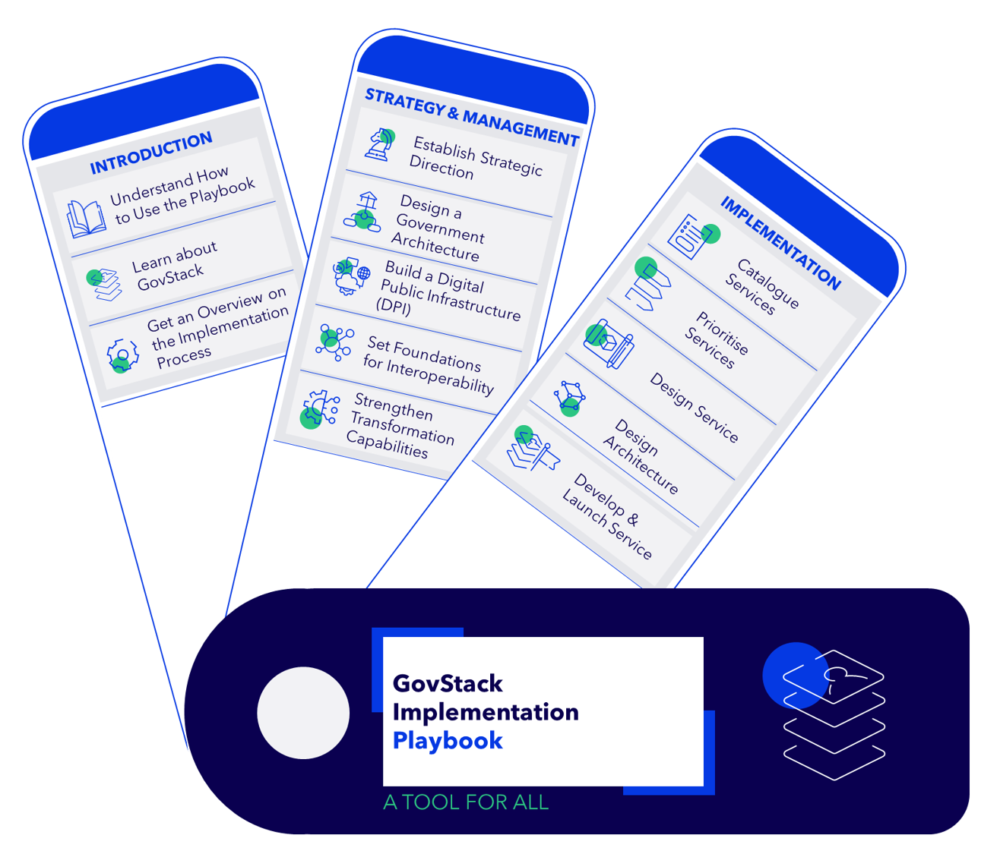
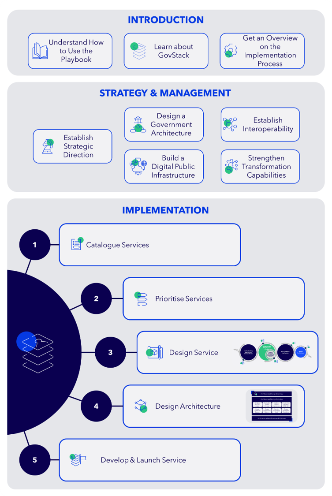
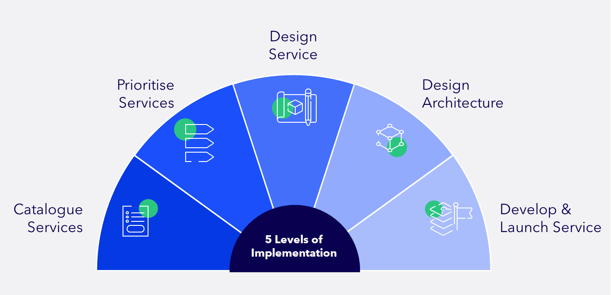

# Understand How to Use the Playbook

<figure><figcaption></figcaption></figure>

### What is the Playbook?

The GovStack Implementation Playbook is a step-by step guide designed for governments that assists in planning, designing, developing and implementing a digital public service.

Developing effective and sustainable e‑government services is challenging. Many governments struggle with fragmented systems, lack of or limited interoperability, increasing user needs, and a lack of shared standards across institutions. The result of these challenges is slow delivery, duplicated efforts, and services that do not align with the needs of people and businesses. To overcome this challenge, the Implementation Playbook offers a structured approach for designing and delivering digital public services.

The Playbook offers examples, tools and resources that guide digital teams on how to apply GovStack’s Building Blocks, which are reusable, interoperable software components, for effective digital public service delivery.

You can use the Implementation Playbook to deliver government services at national, state, municipal, and local levels. Governments can get started at any stage of the service delivery lifecycle, depending on their objectives, context, and needs.

### How to navigate the Playbook

The Playbook is organized into three overarching sections (see figure below):

I.    Introduction

II.   Strategy and Management

III.  Implementation

<figure><figcaption></figcaption></figure>

<strong>INTRODUCTION</strong>

Use the Introduction section to familiarise yourself with the GovStack Initiative and to learn how to get the most out of the Playbook. The Introduction section includes three key elements. First, it helps you understand how to use the Playbook. Second, it provides an opportunity to learn about GovStack and its most important concepts, including the Building Blocks and its core terminology, enabling a shared understanding across various teams. Third, it provides you with a high-level overview of the implementation process, preparing you for the detailed guidance that follows.

This section is structured as follows:

1. Understand How to Use the Playbook
2. Learn About GovStack
3. Get an Overview on the Implementation Process

<strong>STRATEGY &#x26; MANAGEMENT</strong>

In this section, you will explore the "Strategy and Management" concepts that underpin an end-to-end digital public service transformation. You will also learn how to establish strategic foundations that inform and support subsequent implementation activities. These strategic priorities reinforce one another and often must be developed in parallel.

By the end of the "Strategy & Management" section, you will be able to understand how to define clear priorities, establish the structures required for sustainable digital transformation, and create the conditions that enable effective service delivery.

This section follows the below order:

1. Establish Strategic Direction

* Maturity Assessment
* Digital Strategy
* Scaling Strategy

2. Design a Government Architecture
3. Build a Digital Public Infrastructure (DPI)

* Cross-Border DPI in the East African Community (EAC)

4. Establish Interoperability
5. Strengthen Transformation Capabilities

* Change Management
* Capacity Building
* Digital Team Composition

<strong>IMPLEMENTATION</strong>

After establishing the strategic foundations, the implementation section provides structured, step-by-step guidance for designing, building and launching a digital public service. &#x20;

Here, you will learn everything from identifying a service need to delivering a fully functioning digital public service. You begin by gaining a clear understanding of the services that already exist. This will help you recognise gaps, opportunities, and areas for improvement. In the following step, you proceed to learn how to prioritise services, based on user needs, feasibility, and estimated impact.

Once a service has been selected for digitalisation, the Implementation Playbook guides you through the service design process by helping you understand the current state (As-Is) and map out the desired future state (To-Be). However, remember to also read the “Ensuring Inclusion & Accessibility When Designing E-Government Services" chapter, as it guides you through testing the service to ensure it is inclusive and accessible for all users.

The next phase focuses on designing a robust software architecture that allows the service to operate reliably and securely, recognising that functional, scalable and responsive services are essential for effective public service delivery.&#x20;

Based on these foundations, the next phase explains the process of developing, launching, and maintaining the service. Thus, towards the end of the Implementation section, you will have a clear understanding of how to translate your strategic intentions into a practical, citizen-centric service that can be delivered effectively and sustained in the long run.

You will find a simple visual of the overview process below:

<figure><figcaption></figcaption></figure>

The Implementation section is structured as follows:

1. Catalogue Services&#x20;
2. Prioritize Services
3. Design Service
   1. Understanding the Current Service (As-Is)
   2. Designing the Future Service (To-Be)
   3. Testing and Validating the Service
   4. Analyze Requirements (Continue with Architecture Design)
   5. Ensuring Inclusion and Accessibility When Designing E-Government Services
4. Design Architecture
   1. Architecture Design Overview
   2. Analyze Requirements
   3. Start with the System Context
   4. System Landscape
   5. System Architecture
   6. Architecture Best Practices & Patterns&#x20;
5. Develop and Launch Services
   1. Selecting Software and Service Providers
   2. Software Development Cycle &#x20;
   3. Launching the Service&#x20;

### &#x20;Who is the Playbook for?

The Playbook is intended to be used by digital teams: Service designers, solution architects, developers, lawyers, product managers, behavioral scientists, and user need researchers. Furthermore, the Playbook also addresses key stakeholders across the government who shape the direction, governance and operation of digital transformation efforts. These include policymakers, program and project managers, procurement and vendor management teams, and capacity building teams, among others who are involved in the digitalization process.

Depending on your background, some contents may be more relevant to you than others. Hence, please use the table below to identify which chapters you should prioritise, especially if you have limited time.

| Type of reader                                                 | Chapters to read                                                                                                                                                                                                                                                                                                                                                                                                                                                                                                                                                                                                                                                                                                                                                                                                                                                                     |
| -------------------------------------------------------------- | ------------------------------------------------------------------------------------------------------------------------------------------------------------------------------------------------------------------------------------------------------------------------------------------------------------------------------------------------------------------------------------------------------------------------------------------------------------------------------------------------------------------------------------------------------------------------------------------------------------------------------------------------------------------------------------------------------------------------------------------------------------------------------------------------------------------------------------------------------------------------------------ |
| 
Government Decision-Makers / 

Policy Leaders
      | <ul><li><a href="./#introduction">Introduction</a></li><li><a href="./#strategy-and-management">Strategy and Management</a></li></ul>                                                                                                                                                                                                                                                                                                                                                                                                                                                                                                                                                                                                                                                                                                                                                |
| 
Program/

Project Managers
                         | <ul><li><a href="./#introduction">Introduction</a></li><li><a href="./#strategy-and-management">Strategy &#x26; Management </a></li><li><a href="./#implementation">Implementation</a></li></ul>                                                                                                                                                                                                                                                                                                                                                                                                                                                                                                                                                                                                                                                                                     |
| 
Service Designers/ 

UX Researchers
                | <ul><li><a href="./#introduction">Introduction</a></li><li><a href="implementation/design-service/">Design Service (under Implementation)</a></li></ul>                                                                                                                                                                                                                                                                                                                                                                                                                                                                                                                                                                                                                                                                                                                              |
| 
Enterprise/ 

Solution Architects
                  | <ul><li><a href="./#introduction">Introduction</a></li><li><a href="strategy-and-management/design-a-government-architecture.md">Design a Government Architecture (under Strategy &#x26; Management)</a></li><li><a href="strategy-and-management/build-a-digital-public-infrastructure-dpi/">Build a Digital Public Infrastructure (DPI) (under Strategy &#x26; Management)</a></li><li><a href="strategy-and-management/establish-interoperability.md">Establish Interoperability (under Strategy &#x26; Management)  </a></li><li><a href="implementation/design-architecture/">Design Architecture (under Implementation)</a></li></ul>                                                                                                                                                                                                                                          |
| 
Technical Teams/ 

Developers
                      | <ul><li><a href="./#introduction">Introduction</a></li><li><a href="implementation/design-architecture/">Design Architecture (under Implementation)</a></li><li><a href="implementation/procure-and-launch-services/">Develop and Launch a Service (under Implementation)</a></li></ul>                                                                                                                                                                                                                                                                                                                                                                                                                                                                                                                                                                                              |
| 
Capacity-Building &#x26; 

Change Management Teams
 | <ul><li><a href="strategy-and-management/strengthen-transformation-capabilities/">Strengthen Transformation Capabilities (under Strategy &#x26; Management)</a></li><li><a href="implementation/design-service/ensuring-inclusion-and-accessibility-when-designing-e-government-services.md">Ensuring Inclusion &#x26; Accessibility When Designing E-Government Services (under Implementation - Design Service)</a></li></ul>                                                                                                                                                                                                                                                                                                                                                                                                                                                      |
| 
Procurement &#x26; Vendor

Management Teams
        | <ul><li><a href="strategy-and-management/establish-strategic-direction/">Establish Strategic Direction (under Strategy &#x26; Management)</a></li><li><a href="strategy-and-management/build-a-digital-public-infrastructure-dpi/">Build a Digital Public Infrastructure (DPI) (under Strategy &#x26; Management)</a></li><li><a href="strategy-and-management/establish-interoperability.md">Establish Interoperability (under Strategy &#x26; Management)</a></li><li><a data-footnote-ref href="#user-content-fn-1">Selecting Software &#x26; Service Providers (under Implementation - Develop &#x26; Launch a Service)</a></li></ul>                                                                                                                                                                                                                                            |
| Legal & Policy Advisors                                        | <ul><li><a href="strategy-and-management/establish-strategic-direction/">Establish Strategic Direction (under Strategy &#x26; Management)</a></li><li><a href="strategy-and-management/design-a-government-architecture.md">Design a Government Architecture (under Strategy &#x26; Management)</a></li><li><a href="strategy-and-management/build-a-digital-public-infrastructure-dpi/">Build a Digital Public Infrastructure (DPI) (under Strategy &#x26; Management)</a></li><li><a href="strategy-and-management/establish-interoperability.md">Establish Interoperability (under Strategy &#x26; Management)</a></li><li><a href="implementation/design-service/ensuring-inclusion-and-accessibility-when-designing-e-government-services.md">Ensuring Inclusion &#x26; Accessibility When Designing E-Government Services (under Implementation- Design Service)</a></li></ul> |
| Communication & Stakeholder Engagement Teams                   | <ul><li><a href="strategy-and-management/strengthen-transformation-capabilities/change-management/">Change Management (under Strategy &#x26; Management- Strengthen Transformation Capabilities)</a></li><li><a href="implementation/design-service/3-testing-and-validating-the-service/">Testing and Validating the Service (under Implementation)</a></li><li><a href="implementation/procure-and-launch-services/launching-the-service.md">Launching the Service (under Implementation- Develop &#x26; Launch a Service)</a></li></ul>                                                                                                                                                                                                                                                                                                                                           |

### How is the Playbook developed and kept updated?


During feedback sessions we received a lot of valuable feedback. Not all feedback could be adressed in the current release. A backlog of change request and issues can be found on the [Playbook's GitHub repository](https://github.com/GovStackWorkingGroup/implementation-playbook/issues).


The Playbook is a continuous co-design effort by a multidisciplinary team of experts representing GovStack founding partners ([ITU](https://www.itu.int/en/Pages/default.aspx), [EE](https://e-estonia.com/), [GIZ](https://www.giz.de/en/html/index.html), [DIAL](https://dial.global/)), implementing partners such as EstDev, FIIAAP, Taltech, Capgemini, and digital teams from governments that participate in TAC review.&#x20;

The Playbook also integrates a curated set of best practices coming from different assessment frameworks developed by International Organizations like ITU, OECD, UNDP, and World Bank, among others. It also gathers reference tools and methods from digital services manuals, and design standards developed by different digital service teams worldwide. Like but not limited to:

* The Government Digital Service in the United Kingdom&#x20;
* 18F in the United States
* gob.pe digital service team in Perú&#x20;
* gob.mx digital service team in México
* Canada Digital Service&#x20;
* Australia Digital Government Office
* Ireland Digital Service&#x20;

The Playbook is in continuous iteration according to country implementation feedback.

How to submit feedback?

One of the cornerstones of our commitment to excellence is our unwavering dedication to listening to you, our readers. Your feedback is invaluable to us. We don't just collect it; we cherish it. Your thoughts, opinions, and suggestions are the compass guiding our journey toward continuous improvement.&#x20;

You can write contact the community secretary at community@govstack.global

or you can open an issue in the playbook's GitHub repository: [https://github.com/GovStackWorkingGroup/implementation-playbook](https://github.com/GovStackWorkingGroup/implementation-playbook)

or, which is **our preferred way** of getting in contact with you, join our working group on the implementation playbook. Fill in the following form and we will invite you to slack and our working group meetings: [https://govstack.global/join-our-tech-community/](https://govstack.global/join-our-tech-community/)

[^1]: ADD LINK
