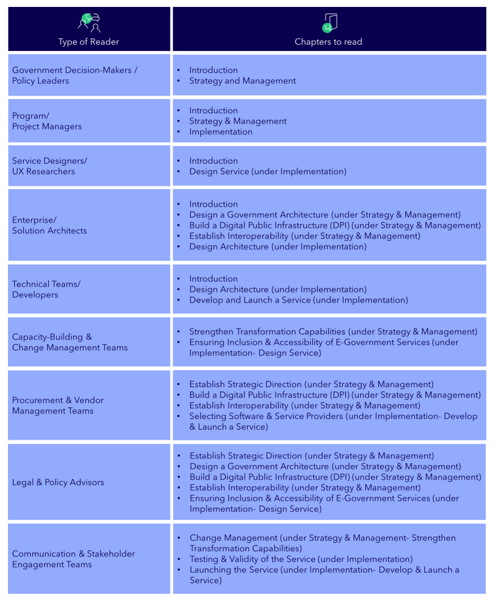

# Understand How to Use the Playbook

<figure><figcaption></figcaption></figure>

### What is the Playbook?

The GovStack Implementation Playbook is a step-by step guide designed for governments that assists in planning, designing, developing and implementing a digital public service.

Developing effective and sustainable e‑government services is challenging. Many governments struggle with fragmented systems, lack of or limited interoperability, increasing user needs, and a lack of shared standards across institutions. The result of these challenges is slow delivery, duplicated efforts, and services that do not align with the needs of people and businesses. To overcome this challenge, the Implementation Playbook offers a structured approach for designing and delivering digital public services.

The Playbook offers examples, tools and resources that guide digital teams on how to apply GovStack’s Building Blocks, which are reusable, interoperable software components, for effective digital public service delivery.

You can use the Implementation Playbook to deliver government services at national, state, municipal, and local levels. Governments can get started at any stage of the service delivery lifecycle, depending on their objectives, context, and needs.

### How to navigate the Playbook

The Playbook is organized into three overarching sections (see figure below):

I.    Introduction

II.   Strategy and Management

III.  Implementation

<figure><figcaption></figcaption></figure>

<strong>INTRODUCTION</strong>

Use the Introduction section to familiarize yourself with the GovStack Initiative and learn how to get the most out of the Playbook. The Introduction section includes three key elements. First, it helps you understand how to use the Playbook. Second, it provides an opportunity to learn about GovStack. Furthermore, you’ll get an overview of GovStack’s important concepts, such as Building Blocks and key terminology, enabling a shared understanding across various teams. Third, it provides you with a high-level overview of the implementation process, preparing you for the detailed guidance that follows.

Overall, this section assists you in understanding how the Playbook works, how you can navigate through it, and what GovStack is, enabling you to utilize the Playbook to develop successful e-government services. It summarizes the entire service delivery process, allowing you to gain a first high-level overview of how all chapters and steps connect to one another.

<strong>STRATEGY &#x26; MANAGEMENT</strong>

In this section, you will explore the Strategy and Management concepts that underpin an end-to-end digital public service transformation. Here, you will learn how to establish strategic foundations that inform and support subsequent implementation activities. These strategic priorities reinforce one another and often must be developed in parallel.

By the end of this section, you will be able to understand how to define clear priorities, establish the structures required for sustainable digital transformation, and create the conditions that enable effective service delivery.

This section follows the below order:

·       Establish Strategic Direction

·       Design a Government Architecture

·       Build a Digital Public Infrastructure (DPI)

·       Establish Interoperability

·       Strengthen Transformation Capabilities

<strong>IMPLEMENTATION</strong>

After establishing strategic foundations, the implementation section suggests you with practical steps to design, build and launch a digital public service. &#x20;

Here, you will learn from identifying a service need to deliver a fully functioning digital public service. You begin by gaining a clear understanding of the services that already exist. This will help you recognise gaps, opportunities, and areas for improvement. Following this, you proceed to learn how to prioritise services, which ones to focus on, based on user needs, feasibility, and estimated impact.

Once a decision regarding which service to digitize has been made, the Implementation Playbook guides you through designing the service, such that it reflects both the current reality and the desired future state. Do not forget to read the “Ensuring Inclusion & Accessibility of E-Government Service chapter”, as it guides you to test the service, so that it is inclusive, and accessible for all users.

Further, you will find how to design software architecture that allows the service to operate reliably and securely. Functional, scalable and responsive services are extremely crucial for effective public service delivery. Incorporating that, this section explains the process of developing, launching, and maintaining the service. Towards the end of the Implementation section, you will have a clear understanding of how to translate your strategic intentions into a practical, citizen-centric service that can be delivered effectively and sustained in the long run.

You will find a simple visual of the overview process below:

<figure><figcaption></figcaption></figure>

The Implementation section is structured as follows:

1. Catalogue Services&#x20;
2. Prioritize Services
3. Design Service
   1. Understanding the Current Service (As-Is)
   2. Designing the Future Service (To-Be)
   3. Testing and Validating the Service
   4. Ensuring Inclusion and Accessibility of E-Government Services
4. Design Architecture
   1. Architecture Design Overview
   2. Process Description & Activities for Architecture Planning
   3. Best Practices & Patterns for Architecture Planning
5. Develop and Launch Service
   1. Selecting Software and Service Providers
   2. Software Development Cycle
   3. Infrastructure Architecture &#x20;
   4. Launching the Service&#x20;
   5. Maintaining &#x20;

### &#x20;Who is the Playbook for?

The Playbook is intended to be used by digital teams: Service designers, solution architects, developers, lawyers, product managers, behavioral scientists, and user need researchers. Furthermore, the Playbook also addresses key stakeholders across government who shape the direction, governance and operation of digital transformation efforts. These include policymakers, program and project managers, procurement and vendor management teams, and capacity building teams, amongst others who are involved in the digitalization process.

Depending on your background, some contents may be more relevant to you than others. Please use the table below to identify which chapters you should prioritise, especially if you have limited time, and to get an estimate of how long each section will take you to read.

<figure><figcaption></figcaption></figure>

### How is the Playbook developed and kept updated?

The Playbook is a continuous co-design effort by a multidisciplinary team of experts representing GovStack founding partners ([ITU](https://www.itu.int/en/Pages/default.aspx), [EE](https://e-estonia.com/), [GIZ](https://www.giz.de/en/html/index.html), [DIAL](https://dial.global/)), implementing partners such as EstDev, FIIAAP, Taltech, Capgemini, and digital teams from governments that participate in TAC review.&#x20;

The Playbook also integrates a curated set of best practices coming from different assessment frameworks developed by International Organizations like ITU, OECD, UNDP, and World Bank, among others. It also gathers reference tools and methods from digital services manuals, and design standards developed by different digital service teams worldwide. Like but not limited to:

* The Government Digital Service in the United Kingdom&#x20;
* 18F in the United States
* gob.pe digital service team in Perú&#x20;
* gob.mx digital service team in México
* Canada Digital Service&#x20;
* Australia Digital Government Office
* Ireland Digital Service&#x20;

The Playbook is in continuous iteration according to country implementation feedback.

How to submit feedback?

One of the cornerstones of our commitment to excellence is our unwavering dedication to listening to you, our readers. Your feedback is invaluable to us. We don't just collect it; we cherish it. Your thoughts, opinions, and suggestions are the compass guiding our journey toward continuous improvement.&#x20;

You can write contact the community secretary at community@govstack.global

Or, which is our preffered way of getting in contact with you, join our working group on the implementation playbook. Fill in the following form and we will invite you to slack and our working group meetings: [https://govstack.global/join-our-tech-community/](https://govstack.global/join-our-tech-community/)

