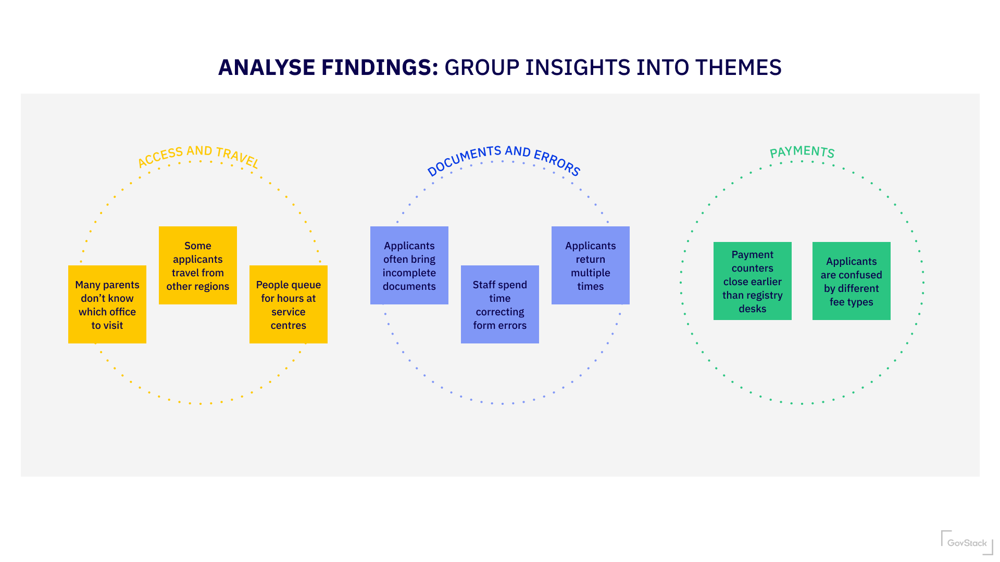

# C.2 Conduct Early Usability and Inclusive Testing\*

## Test with real users

Test prototypes with real users to understand whether concepts, content, and flows work as intended.

<strong>How to do it</strong>

Testing with real users usually follows a simple loop:

1. Prepare to test
2. Recruit users
3. Test with users
4. Review what you learned
5. Decide what to change or test next

#### 1. Prepare to test 

<figure><figcaption></figcaption></figure>

Before testing, teams should agree:

* what they are testing (for example a journey, task, or decision point)
* what they want to learn
* which user groups to involve
* how many sessions are realistic

Document decisions using a discussion guide print out

#### 2. Recruit participants 

Identify and recruit people who reflect the users you want to learn from.

Teams should agree:

* which user groups to involve
* how many participants are realistic (ofter 5-8 is enough to highlight 80% of the issues)
* how they will be contacted or invited
* who is responsible for recruitment

\[Link: Recruitment criteria]

When contacting potential participants, make sure they understand:

* why they are being involved
* what will happen during the session
* how their data will be used

\[Link: Consent form template]

#### 3. Run testing sessions 

During testing, focus on observing behaviour and listening, rather than explaining or defending the design.

1. **Test comprehension**\
   Ask users to:
   * think aloud
   * explain what they think the service does
   * describe what they believe will happen next
   * interpret key instructions, questions, or messages
2. **Capture issues and questions**\
   Note where users:
   * hesitate or get confused
   * misinterpret content
   * expect something different

Use a short discussion guide printout to stay focused.

#### 4. Capture and review findings 

After testing, bring the team together to review what was learned. Look for:

* repeated issues or patterns
* differences between user groups
* assumptions that were challenged
* ideas that clearly worked or failed

Capture findings in simple language that others can understand.

Refer back to the guidance on [Analysing research findings](https://govstack-global.atlassian.net/wiki/spaces/GH/pages/1669464107)

<figure><figcaption></figcaption></figure>

#### 5. Decide what to change or test next 

Use what you’ve learned to decide:

* what to improve or change in the prototype
* what assumptions need further testing
* whether the current direction is strong enough to continue

Testing is most effective when it feeds directly into iteration.

<strong>Research operations (supporting guidance)</strong>

Research operations enable safe and repeatable testing but should be lightweight and proportionate.

Teams should consider:

* informed consent and participant understanding
* safeguarding and data protection requirements
* secure storage of notes and recordings
* clear ownership of research activities

Not all services require the same level of formality.

\[Link: Consent and ethics checklist]\
\[Link: Data protection guidance]\
\[Link: Recruiting participants guidance]

<strong>Outputs</strong>

* [ ] notes or summaries from user testing sessions
* [ ] identified usability, content, or flow issues
* [ ] clear changes made as a result of testing

