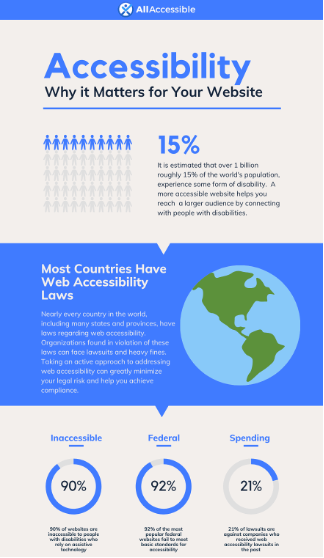

# Ensuring Inclusion and Accessibility When Designing E-Government Services

### Why inclusive and accessible digital services matter 

Over the past couple of years, the topic of inclusion and accessibility has increased in importance not only socially but also legally since approximately 15% of the world’s population experience some sort of disability (see figure below) _(AllAccessible, 2022)_. When designing digital government services, it is thus focal to ensure that every citizen, regardless of their abilities, language, gender, or social status, is given the opportunity to access digital government programs _(United Nations Office at Geneva, n.d.)_.

<figure><figcaption>
(AllAccessible, 2022)
</figcaption></figure>

Moreover, the UK government provides a summary of the most important information about digital inclusivity and and how to center accessibility in digital services (see video below).



(GOV.UK, 2013) [https://www.youtube.com/watch?v=o-ma\_Awfn5M](https://www.youtube.com/watch?v=o-ma_Awfn5M)

### Ensuring accessibility for all citizen 

In order to properly design digital government services, countries need to anchor accessibility in their vision, principles, and governance structures. This requires countries to:

* **Adopt an “Accessibility-by-Default” Principle:** Digital services should be designed so that accessibility is embedded as a standard feature, ensuring usability for all individuals regardless of ability, language, or social background _(Liferay, 2015)_. In this context, a shift‑left approach is often referenced as a complementary practice: It reinforces the principle by integrating accessibility considerations as early as possible in the design and development process, rather than addressing them only at later stages.
* **Develop User-Centric Design Guided by Diversity:** Co-design processes should be established and intentionally engage diverse user groups from the outset. This ensures that interfaces and service interactions are shaped by a broad range of linguistic abilities, cultural contexts, and accessibility needs, resulting in solutions that are inclusive by design (Sarma & Vethantham, 2025).
* **Ensure that Governments Documents are Accessible Digitally:** Digital documents must fulfill Web Content Accessibility Guidelines [(WCAG) 2.2 AA requirements](https://www.w3.org/TR/WCAG22/), utilize clear language and support screen readers with full keyboard navigation _(Sarma & Vethantham, 2025)_.

### Legal, technical & organizational requirements 

When ensuring inclusion and accessibility via legislation, EU legislation and standards can act as a good example:

* [**WCAG (Web Content Accessibility Guidelines):**](https://www.w3.org/WAI/standards-guidelines/wcag/) International guidelines from the World Wide Web Consortium (W3C) that require the design of digital content to be perceivable, operable, understandable, and robust for all people, including those with disabilities, adding further requirements for operability and focus indicators, with conformance levels A, AA, and AAA _(Initiative, 2025)._
* [**European Accessibility Act:**](https://commission.europa.eu/strategy-and-policy/policies/justice-and-fundamental-rights/disability/union-equality-strategy-rights-persons-disabilities-2021-2030/european-accessibility-act_en) Law that requires companies as well as public sector bodies to provide digital products and services including websites, apps, online shops, and banking services in an accessible format to ensure equal access for individuals with disabilities _(European Accessibility Act, 2025)_. For example, the graph below illustrates how the EAA in Germany is divided into BFSG for private companies and BITV for public sector bodies.
* [**Web Accessibility Directive (EU 2016/2102):**](https://digital-strategy.ec.europa.eu/en/policies/web-accessibility-directive-standards-and-harmonisation) EU legislation which requires public websites and apps within the EU to be accessible and comply with the WCAG 2.1 Level AA standard, ensuring that digital content is accessible to all people, including those with disabilities _(European Commission, n.d.)_.
* [**EN 301 549:**](https://www.etsi.org/deliver/etsi_en/301500_301599/301549/03.02.01_60/en_301549v030201p.pdf) European standard for accessibility in information and communication technologies (ICT) that defines technical requirements to facilitate the accessibility of software, hardware, websites, and digital services for people with disabilities _(ETSI et.al, 2021)_.

Based on this, each EU member state designs its own digital accessibility frameworks, such as Germany's [Barrier-Free Accessibility Act (BFSG).](https://www.bmas.de/DE/Service/Gesetze-und-Gesetzesvorhaben/barrierefreiheitsstaerkungsgesetz.html) _(Bundesministerium für Arbeit und Soziales, 2021)._

<figure><figcaption>
Laws and Guidelines for Accessibility <em>(Capgemini Invent, 2025)</em>
</figcaption></figure>

### Barriers to accessibility & how they can be overcome  

1. **Technical Barriers:**&#x20;

Currently, many governments are still struggling with the technological implementation of digital services and highly complex user interfaces _(Morte-Nadal & Esteban-Navarro, 2022)_.

_Possible Solution Approaches:_

* Simplify and standardize user interfaces through user-centric development
* Strengthen backend infrastructure and warrant stable, scalable platforms

2. **Social & Demographic Barriers:**&#x20;

Rural places generally shortage dependable broadband, limiting connectivity. Language difficulties for non-English speakers also diminish involvement. Together, these challenges restrict fair involvement in digital governance. In addition, age differences represent a problem. Older adults more often encounter accessibility obstacles like too small text and complex interfaces _(Sarma & Vethantham, 2025)_. For example, 55% of seniors above 65 are considered severely handicapped in Germany.

_Possible Solution Approaches:_

* Offer multilingual interfaces and easy comprehensible language
* Provide digital support for communities (e.g. libraries) targeted at elderly, rural, or marginalized groups
* Incorporate inclusive testing with diverse user groups to detect barriers early

3. **Economic Barriers:**&#x20;

Economic barriers arise from the fact that financial resources largely determine whether citizens have access to digital services and can employ them effectively _(Sarma & Vethantham, 2025)_.

_Possible Solution Approaches:_

* Increase access to reasonably priced broadband, especially in underdeveloped communities
* Support low-income households with free training to improve digital skills

4. **Institutional Barriers:**&#x20;

Digital services are often designed according to internal procedures rather than the needs of citizens, resulting in complex interaction channels _(Morte-Nadal und Esteban-Navarro, 2022)_.

_Possible Solution Approaches:_

* §  Shift from administration-centered to user-centered service design, guided by accessibility standards, for example the [CDS (Citizen Services Design)](https://www.capgemini.com/solutions/citizen-services/) by the UK government

### Roles 

In order to implement inclusion and accessibility optimally, various roles must work together, including:

* **Policy Makers:** Draft and enforce accessibility regulations (e.g., WCAG compliance)
* **Senior Government Executives:** Set strategic priorities and approve budgets
* **Government Tech Teams:** Conduct audits and fix accessibility issues
* **Service Design Teams:** Apply user-centered design principles for inclusivity and test with diverse user groups

### Best practices for sustainable implementation (optional) 

Below are best practice examples with regard to digital inclusion that are already being implemented by governments:

* **Development of comprehensive online government portals:** Nations as the UK and Estonia demonstrate that central platforms (e.g., [http://gov.uk/](http://gov.uk/)) enable citizens to access all government services easily and consistently [_(Sarma & Vethantham, 2025)_.](https://www.continualengine.com/blog/inclusive-government-digital-documents/)
* **Strong digital identity frameworks:** Universal digital IDs reduce barriers for remote users, people with disabilities, or people without complicated technical equipment [_(Sarma & Vethantham, 2025)_.](https://www.continualengine.com/blog/inclusive-government-digital-documents/)
* **Constant accessibility reviews according to WCAG:** Ongoing accessibility testing assures that digital services comply with standards [_(Sarma & Vethantham, 2025)_.](https://www.continualengine.com/blog/inclusive-government-digital-documents/)
* **Mobile-first design:** Services should function optimally on mobile devices to increase the user rate [_(Sarma & Vethantham, 2025)_.](https://www.continualengine.com/blog/inclusive-government-digital-documents/)
* **Creating inclusive e-Governance innovations:** Digital signatures, e-residency, and online citizen services are examples of pioneering tools that improve participation [_(Sarma & Vethantham, 2025)_.](https://www.continualengine.com/blog/inclusive-government-digital-documents/)
* **Multi-stakeholder approach:** To achieve digital inclusion, political decision-makers, administrators, NGOs, educators, corporations, and citizens should work together [_(Morte-Nadal und Esteban-Navarro, 2022)._](https://doi.org/10.1177/16094069211070935)

To provide an overview of different types of disabilities and the dos and don'ts of inclusion, the UK government has published the following chart below:

<figure><figcaption>
Do's and Don'ts on designing for accessibility (Pun, 2016) <a href="https://accessibility.blog.gov.uk/2016/09/02/dos-and-donts-on-designing-for-accessibility/">https://accessibility.blog.gov.uk/2016/09/02/dos-and-donts-on-designing-for-accessibility/</a>
</figcaption></figure>
