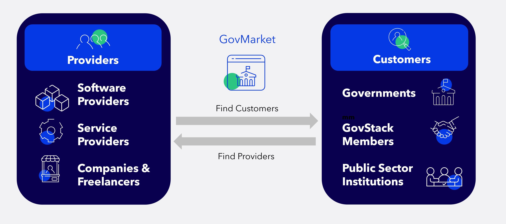

# 2. Collect Market Insights

This section outlines the key activites of collecting insights, such as early market engagement as a feedback mechanism, the use of GovMarket, and the distinction between software and service provider research. It also provides links to relevant procurement resources. Together, these elements help institutions build a full picture of the market while preparing for the next stage of the procurement process.

### Use of Market Research for Feedback

Public institutions can use a structured market research approach to get an overview of the existing capabilities, standards and solutions in the marketplace. This may be done before initiating a formal procurement process. A structured market research approach enables governments to validate assumptions, refine technical requirements, and design tenders that are realistic.

International procurement frameworks consistently position market research as a core mechanism for informed decision‑making.

* The **EU ICT Procurement Guidelines** instruct institutions to apply market research proactively when defining technical specifications. This helps identify existing ICT solutions, assess their reusability, understand available open standards, and avoid vendor lock‑in.
* The **World Bank Procurement Framework** similarly calls for early market engagement research to ensure procurement practices align with actual market capabilities and support value‑for‑money outcomes.

The graphic below illustrates the early market engagement cycle.

<figure><figcaption>
Early Market Engagement: Information Flows Between Governments and Stakeholders
</figcaption></figure>

Early engagement with the market encourages governments to understand which GovStack‑aligned solutions or components already exist and to identify which technical standards, APIs, and architectural patterns are widely supported in the market. Furthermore, it helps in analyzing realistic cost structures, licensing models, and implementation timelines. Governments can also benefit from this practice by assessing where innovation is emerging and how it may influence requirements and by avoiding tailored solutions that reduce competition or restrict interoperability.

Typical market research activities include:

* Issuing Requests for Information (RFIs) or supplier questionnaires to gather non‑binding input
* Hosting transparent supplier consultations or briefings, ensuring equal access for all potential bidders
* Reviewing existing reusable government ICT solutions, as recommended in EU guidance
* Testing preliminary concepts through demos, sandbox sessions, or pilots
* Consulting other governments or agencies that have implemented similar digital public infrastructure
* Mapping market‑supported standards, protocols, and interoperability profiles relevant to GovStack BBs

By feeding insights from these activities back into the requirement‑setting and the selection process, governments can create tender opportunities that are technically viable and competition‑friendly.

By channeling feedback from suppliers (RFIs, consultations), market scans (capabilities, cost and licensing patterns), standards reviews (APIs, interoperability profiles), and peer governments (implementation lessons) into requirements and evaluation criteria, teams shape tenders that are technically feasible and competition‑friendly.

Capture what is broadly supported, flag constraints early, and document any justified deviations from GovStack‑aligned standards for governance review. The result is provider selection that builds resilient, interoperable, future‑ready digital public services consistent with the GovStack approach.

To further support this research phase, governments can use GovMarket to explore GovStack‑aligned software solutions and service providers. The platform acts as a matchmaking tool, helping institutions understand which providers operate within the GovStack framework. Moreover, it offers a structured overview of the existing digital solution landscape before procurement begins.

<strong>GovMarket</strong>

To enable this matchmaking process, GovStack offers a suite of services including the [GovMarket](https://govstack.global/our-offerings/govmarket/). GovMarket is an online database that helps governments and service providers find each other based on a common reference point: [GovSpecs](https://govstack.global/our-offerings/govspecs/). See image below to understand how GovMarket facilitates this process.

<figure><figcaption>
GovMarket as a match making tool between providers and customers
</figcaption></figure>

**Function of GovMarket - for Governments:**

During the phase of researching, planning or procuring software or services, GovMarket enables the countries to:

* Identify software that is compliant to one or more [Building Block Specifications.](https://specs.govstack.global/building-blocks/about-building-blocks)
* Identify service providers offering advisory, implementation or other services aligned to the GovStack approach.

**Function of GovMarket - for Providers:**

For providers, GovMarket offers a unified way to showcase software and services to potential customers, and enables them to:

* Find RFPs, contracts or other funding opportunities published by governments using the GovStack approach.
* Find Request for Proposals from Governments using the GovStack approach.

Hence, by using GovMarket, governments can find both software providers and services that offer, for example, [advisory, assist with implementation, or maintenance.](https://govstack.global/companies/) The BB software providers are assessed against [Govstack Building Block Specifications](https://specs.govstack.global/) and fulfilling the non- functional requirements such as how solutions should behave and integrate within a modular architecture. The BB Software compliance is measured across categories such as deployment, functional requirements, and API service specifications. You can find detailed information on how compliance is measured [here.](https://govstack.global/software/)

If a country identifies additional potential software providers, they can be introduced to the GovStack pool by participating in the compliance process via the [GovStack Testing App](https://testing.govstack.global/). All information regarding compliance criteria and 'how-to' submit assessments can be found [here.](https://govstack.global/software/)

In addition to software, the platform provides a list of companies and freelancers with proven GovStack experience. These service providers bring expertise in key areas of knowledge and enable countries to choose from an expert pool of service providers. Service providers who would wish to be a part of the pool, can check for information regarding eligibility and application process [here.](https://govstack.global/companies/)

After gaining an initial overview of the available solutions and provides on the GovMarket platform, governments must determine how to evaluate them appropriately. This involves distinguishing software research from service provider research. This differentiation helps institutions evaluate the product and the provider on their own merits.

Both the differentiation analysis and the procurement guidance resources form a part of the research and preparation phase, while also helping institutions transition into the formal procurement of software and service providers.

<strong>Differentiation between Software and Service Provider Research</strong> 

The difference between software provider and service provider research plays an important role in the selection process. This is because a technically strong solution can be delivered by a weak provider and a strong provider can offer a solution that does not meet GovStack’s principles. Despite the same procurement procedure, the software and the service provider should be evaluated separately. Building on this distinction, governments can use structured market research to better understand both types of providers and assess their alignment with technical requirements and GovStack principles.

Both the Software and Service providers are procured under the same laws and regulations. However, the research and evaluation are different for each of them. Software provider research would entail evaluating the product, whereas a service provider will be evaluated for the delivery of the product. &#x20;

**Software Provider Research**

Software research evaluates the technical qualities of the product itself. During this process, the following points should be considered in the assessment. This list is a guiding tool and is not exhaustive:

* Technical specifications & functional performance
* Interoperability & open standards
* Compatibility and reuse
* Security built into the software
* Licensing, ownership & long‑term sustainability

In summary, the purpose of the software research is to determine if the product is technically sound, secure, interoperable, sustainable, and compatible with GovStack’s modular building‑block approach.

**Service Provider Research**

Provider research focuses on evaluating the quality of service providers. During the research, the following points should be taken into consideration. This list acts as a guiding tool and is not exhaustive:

* Supplier qualifications & reliability
* Experience delivering similar public‑sector projects
* Financial stability & risk profile
* Governance, ethics & integrity
* Service delivery capacity & project management
* Long‑term maintenance, Service Level Agreements & support capability

Provider research determines whether the organization has the capability, integrity, stability, and experience to deliver and maintain the successfully.

The table below summarizes the main differences between researching software providers and service providers, their respective objectives, focus areas, and evaluation criteria.

| <mark style="color:blue;">**What is being evaluated?**</mark> | The product is being evaluated on aspects like software functionality, architecture, interoperability, and performance.                                                                                                  | The organization or the individual service provider is being evaluated on aspects like capability, experience, governance, financial stability.                                          | Both assessments determine whether the offer meets public‑sector needs under regulated procurement principles (EU, UNCITRAL). |
| ------------------------------------------------------------- | ------------------------------------------------------------------------------------------------------------------------------------------------------------------------------------------------------------------------ | ---------------------------------------------------------------------------------------------------------------------------------------------------------------------------------------- | ----------------------------------------------------------------------------------------------------------------------------- |
| <mark style="color:blue;">**Primary objective**</mark>        | Ensure the software meets technical requirements, supports open standards, and avoids vendor lock‑in.                                                                                                                    | Ensure the provider can reliably and transparently deliver, maintain, and support the solution long‑term.                                                                                | Both support transparent, fair, and competitive procurement outcomes.                                                         |
| <mark style="color:blue;">**Key evaluation criteria**</mark>  | <ul><li>Compliance with GovStack Building Block (BB) specifications</li><li>Interoperability &#x26; open standards (EUIA)</li><li>Technical performance</li><li>Licensing, reuse, and non-proprietary elements</li></ul> | <ul><li>Supplier qualifications &#x26; reliability (UNCITRAL)</li><li>Past performance and capacity (EU &#x26; WB)</li><li>Financial standing &#x26; governance (UNCITRAL, WB)</li></ul> | Both require objective, non‑discriminatory criteria in line with procurement law.                                             |
| <mark style="color:blue;">**Risk focus**</mark>               | Risks related to technology: lock‑in, incompatibility, lack of standards compliance, poor performance.                                                                                                                   | Risks related to delivery and operations: non‑performance, financial instability, governance failures.                                                                                   | Both aim to reduce contract failure risks and protect public funds (World Bank risk-based procurement).                       |
| <mark style="color:blue;">**Outcome of research**</mark>      | Determines whether the software is suitable, interoperable, scalable, and aligned with GovStack principles.                                                                                                              | Determines whether the provider is competent, reliable, honest, and capable of delivering sustainable services.                                                                          | Both evaluations feed into the same procurement decision under the same legal framework (EU, UNCITRAL, WB).                   |

To support teams in applying these research methodologies in practice, the following resources offer guidance on procedures, rules, and tender approaches used by major institutions.

<strong>Useful Links Outlining Public Tendering Processes for Public Institutions</strong>

Here is a curated set of links to public tender processes, procurement rules, that provide step‑by‑step guidance for public institutions.

* [European Commission – Procedures & Guidelines for Tenders](https://commission.europa.eu/funding-tenders/procedures-guidelines-tenders_en) provides official rules, templates, privacy clauses, and general tendering procedures for EU‑funded contracts.
* [Your Europe – Public Tendering Rules](https://europa.eu/youreurope/business/selling-in-eu/public-contracts/public-tendering-rules/index_en.htm#inline-nav-15) explains different types of procurement processes such as open, restricted, negotiated procedures, innovation partnerships, and provides use cases for each.
* [EU Public Procurement Communications & Guidance](https://single-market-economy.ec.europa.eu/single-market/public-procurement/communications-and-guidance-documents_en) is a set of guidance documents for contracting authorities, including innovation procurement, social criteria, and collusion prevention.
* [EU Public Procurement - Procedures, Rules & Open Tender Portals](https://european-union.europa.eu/live-work-study/public-contracts_en) acts as an entry point to procurement rules, tender portals, and review mechanisms in the EU.
* [The World Bank Procurement Framework](https://www.worldbank.org/ext/en/what-we-do/project-procurement/framework) guides countries to design procurement processes that can achieve value for money, while maintaining fairness, integrity, and transparency.
* [The UNCITRAL Model Law](https://uncitral.un.org/sites/uncitral.un.org/files/media-documents/uncitral/en/2011-model-law-on-public-procurement-e.pdf) on Public Procurement includes detailed rules for tendering, prequalification, evaluation, and contract award.

Once research activities are completed, the next step is to launch the formal procurement process. At this stage, governments can use the adapted SRS, market insights, and provider research to evaluate software and service providers in a structured, transparent manner.
