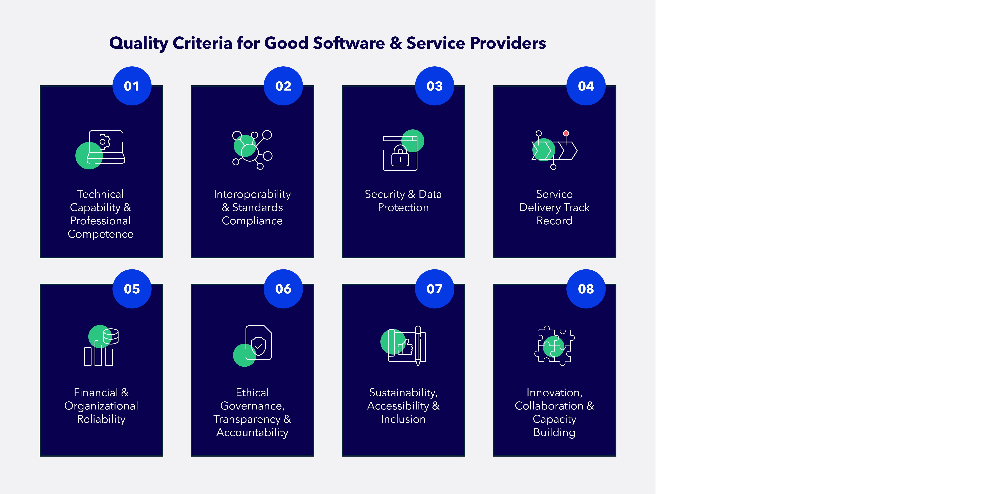

# 3. Procure Software & Service Providers

After gathering market insights and gaining relevant knowledge on procurement guidelines, the next step is to evaluate which providers are best positioned to deliver the required solution. The following quality criteria guides governments through a structured and transparent assessment of both software and service providers.

**Potential Quality Criteria of Good Providers**

Based on international procurement frameworks and best practices, below are 8 potential quality criteria that one must look out for in the service and software provider procurement process. The practical implications, overall, are consistent across the frameworks. When selecting providers, the following requirements must be fulfilled during the process:

* Use of objective, transparent, and non‑discriminatory criteria throughout the selection process
* A structured and well‑documented process
* A thorough assessment of technical and delivery capability
* An evaluation of financial stability and risk exposure
* Consideration of service quality and governance practices
* Focus on long‑term sustainability and interoperability

By applying these principles, governments move beyond mere legal or technical compliance. They establish a foundation for selecting providers that can support resilient, interoperable, and future‑ready digital public services.

<figure><figcaption>
Eight key quality criteria to assess during procurement of providers
</figcaption></figure>

1. **Technical Capability & Professional Competence**

The provider should be assessed on the technical competence to deliver a solution that meets both the functional and non‑functional requirements. Public procurement frameworks award contracts based on technical quality, performance and overall value, and do not solely rely on price.

Technical competence can be verified by reviewing the proofs of concept, prototypes or demonstrations. Doing so will expose how effectively the product performs in real and simulated environments. Further, technical documentation and architectural compliance play an integral role in the selection process. Assessing the qualifications and certifications of key personnel and checking references from similar projects can help justify professional competence.

**How This Principle Applies to Software Providers vs. Service Providers**

<table data-header-hidden><thead><tr><th valign="top">How This Principle Applies to Software Providers vs. Service Providers</th><th></th></tr></thead><tbody><tr><td valign="top">

 

<strong>Software Providers</strong>
</td><td>Demonstrate software architecture quality, API design, code maturity, performance, documentation quality, and the ability to meet security and non‑functional requirements. Prototypes, sandbox tests, and compliance with architectural guidelines are central.</td></tr><tr><td valign="top">

 

<strong>Service Providers</strong>
</td><td>Demonstrate operational delivery capacity, implementation experience, onsite/offsite support capabilities, staffing competence, and project management maturity. References and past deployments are key indicators.</td></tr></tbody></table>

2. **Interoperability & Standards Compliance**

The service provider must operate on open standards and meet the specifications of the GovStack Building Block Architecture. This will ensure interoperability in technologies and allows re-use of digital goods. Moreover, operating on open standards prevents dependency on one vendor and ensures future scalability.

To ensure interoperability and standards compliance qualities in a service, it is important to verify their API documentation, standards compliance declarations and Sandbox integration tests. Additionally, it will be valuable to gather evidence of service integration in other government ecosystems. This will inform governments and teams of the maturity, reliability and practical application of the service in real-world contexts.

**How This Principle Applies to Software Providers vs. Service Providers**

<table data-header-hidden><thead><tr><th valign="top"></th><th></th></tr></thead><tbody><tr><td valign="top">
 

 

<strong>Software Providers</strong>
</td><td>Must demonstrate compliance with GovStack <a href="https://govstack.global/our-offerings/govspecs/">GovSpecs</a>, including API design, data models, workflows, and interoperability requirements. Evidence should include API documentation, standards compliance declarations, and successful sandbox or integration tests.</td></tr><tr><td valign="top">

 

<strong>Service Providers</strong>
</td><td>Must be able to implement, integrate, and maintain standards‑based software within existing government systems. This includes ensuring interoperability during deployment, updates, and long‑term operations, based on GovSpecs guidance.</td></tr></tbody></table>

3. **Security & Data Protection**

Data protection and security are foundational aspects particularly in digital public service delivery. The provider should ensure confidentiality, integrity and availability of services. This is because government systems handle sensitive personal, operational and national-level data. Securing sensitive data will, therefore, build trust in Digital Public Infrastructure.

It is important to verify this criterion of the provider through their security certifications (ISO, SOC) and policies for encryption. This will provide an overview if the provider has mechanisms in place to safely access and control points of sensitive data. Further, the provider must ensure that data is not misused. It is important to check data protection and privacy compliance and evidence of incident response processes.

**How This Principle Applies to Software Providers vs. Service Providers**

<table data-header-hidden><thead><tr><th valign="top"></th><th></th></tr></thead><tbody><tr><td valign="top">
 

 

<strong>Software Providers</strong>
</td><td>Must demonstrate secure software design, data encryption, secure coding practices, vulnerability management, and privacy‑by‑design. Documentation of security controls and compliance audits are essential.</td></tr><tr><td valign="top">

 

<strong>Service Providers</strong>
</td><td>Must demonstrate secure hosting, operational security measures, monitored environments, incident response capabilities, and clear roles and responsibilities for data handling.</td></tr></tbody></table>

4. **Service Delivery Track Record**

A strong indicator of successful service delivery is past performance. It is essential to avoid suppliers with histories of delays or implementation problems. This is further emphasized in the international procurement frameworks. For example, the UNCITRAL model law mandates the assessment of supplier reliability and past performance. Similarly, the World Bank Procurement Framework emphasizes supplier management capacity and performance history.

This can be verified through client references (preferably public sector), acceptance certificates from past contracts and evidence of Service Level Agreement achievement.

**How This Principle Applies to Software Providers vs. Service Providers**

<table data-header-hidden><thead><tr><th valign="top"></th><th></th></tr></thead><tbody><tr><td valign="top">
 

 

<strong>Software Providers</strong>
</td><td>Demonstrate successful deployments of the software in comparable environments, including stability, scalability, and maintenance history. Product release cycles and patch records are relevant.</td></tr><tr><td valign="top">

 

<strong>Service Providers</strong>
</td><td>Demonstrate successful end‑to‑end implementations, adherence to timelines, strong SLA performance, and capacity to manage complex operational environments.</td></tr></tbody></table>

5. **Financial & Organizational Reliability**

To reduce contractual and project risk, it is recommended to assess the financial and organizational capacities of a provider. It is critical to choose financially stable and well-structured providers, as they ensure long-term continuity of services and reliable maintenance.

The reliability of a provider can be verified through audited financial statements, credit checks and evidence of stable revenue and long-term viability. Furthermore, understanding the organizational structure, staffing, and resource plans of the service provider guides governments in choosing a well-structured, financially reliable provider.

**How This Principle Applies to Software Providers vs. Service Providers**

<table data-header-hidden><thead><tr><th valign="top"></th><th></th></tr></thead><tbody><tr><td valign="top">

 

<strong>Software Providers</strong>
</td><td>Must show long‑term product viability, investment in updates, and capacity to support the software lifecycle. Audited statements and development roadmaps help assess stability.</td></tr><tr><td valign="top">

 

<strong>Service Providers</strong>
</td><td>Must show sustained operational capability, adequate staffing, resource allocation, and financial resilience to maintain service delivery throughout the contract period.</td></tr></tbody></table>

6. **Ethical Governance, Transparency & Accountability**

Providers should follow and comply with public-sector rules, such as procurement oversight and review mechanisms. To ensure accountability, reduce the risk of corruption and protect public funds, providers must hold strong governance and ethical conduct.

To ensure that this holds true in the selection process, governments must verify codes of conduct, ethics policies, and anti‑corruption commitments. Further, institutions must consider the set-up and operationalization of reporting templates and escalation procedures, complaint-handling and review mechanisms and a review of the logs of issue resolution.

**How This Principle Applies to Software Providers vs. Service Providers**

<table data-header-hidden><thead><tr><th valign="top"></th><th></th></tr></thead><tbody><tr><td valign="top">
 

 

<strong>Software Providers</strong>
</td><td>Must demonstrate transparent development practices, responsible use of data, and clear licensing and update policies.</td></tr><tr><td valign="top">

 

<strong>Service Providers</strong>
</td><td>Must demonstrate transparent operational processes, quality assurance mechanisms, accountability structures, and compliance with public‑sector oversight.</td></tr></tbody></table>

7. **Sustainability, Accessibility & Inclusion**

Public service delivery must ensure that it is inclusive, environmentally responsible, and accessible to all users. By embedding sustainability and accessibility requirements in the procurement process, it is easy to promote equity, responsible development, and long-term social impact.

It is important to verify this via accessibility testing results (e.g., WCAG compliance), environmental sustainability policies or certifications. It is imperative to ensure that inclusive design and user research practices are in place for effective service delivery to all.

**How This Principle Applies to Software Providers vs. Service Providers**

<table data-header-hidden><thead><tr><th valign="top"></th><th></th></tr></thead><tbody><tr><td valign="top">
 

 

<strong>Software Providers</strong>
</td><td>Ensure accessible user interfaces (WCAG), efficient and sustainable system performance, support for localization, and inclusive design practices.</td></tr><tr><td valign="top">

 

<strong>Service Providers</strong>
</td><td>Ensure inclusive delivery practices, sustainable operational approaches, responsible resource use, and training/support that reaches all user groups.</td></tr></tbody></table>

&#x20;**8. Innovation, Collaboration & Capacity Building**

Governments benefit from providers who can innovate, adapt solutions over time, collaborate effectively, and build local capacity. This reduces long-term dependency and ensures public administrations can maintain and evolve digital services independently.

To ensure this, governments should understand the product and service roadmaps of the selected service providers, investigate past innovations and iterative improvements and evaluate their willingness to pilot new approaches. It is important that the service provider has capacity-building, training plans and knowledge-transfer processes in place.

**How This Principle Applies to Software Providers vs. Service Providers**

<table data-header-hidden><thead><tr><th valign="top"></th><th></th></tr></thead><tbody><tr><td valign="top">
 

<strong>Software Providers</strong>
</td><td>Demonstrate ongoing product innovation, published roadmaps, regular updates, and openness to co‑creation or QA iterations.</td></tr><tr><td valign="top">

 

<strong>Service Providers</strong>
</td><td>Demonstrate ability to train government teams, support iterative improvements, collaborate across institutions, and build operational capacity within ministries or agencies.</td></tr></tbody></table>

Overall, these criteria enable governments to make informed and evidence‑based decisions while selecting providers.  By applying them consistently, institutions are better positioned to choose partners who deliver secure, interoperable, high‑quality, and sustainable digital public services.

Selecting software and service providers requires more than reviewing technical qualifications or comparing prices. It demands clear requirements, strong market insights, and rigorous, objective evaluation of potential providers. Through the GovStack‑aligned procurement process, governments can make procurement decisions that are transparent, evidence‑based, and aligned with long‑term service needs. As a result, governments are better prepared to identify providers who deliver lasting public value and strengthen the resilience of digital service ecosystems.
