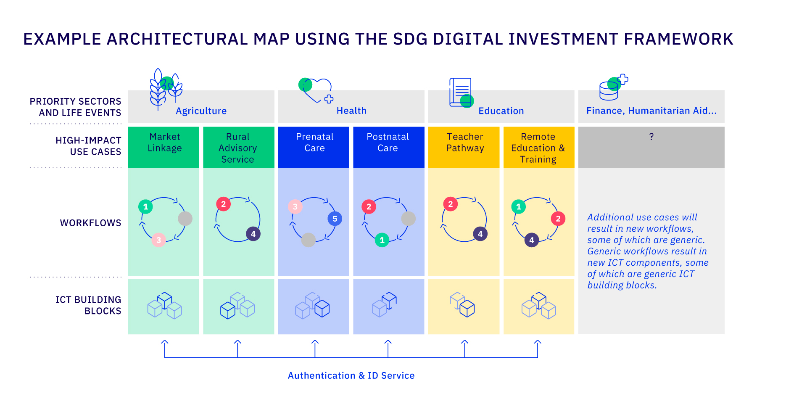

# Learn About GovStack

## About GovStack

What is it?

GovStack initiative is an expert community-driven multistakeholder effort aimed at collecting best technical practices and designing a blueprint for a government architecture and respective Building Blocks for a sustainable and sovereign digital transformation of the public sector.

What does it aim to achieve?

By unpacking and simplifying the technical approach that goes into building holistic digital government, GovStack aims to accelerate countries’ ownership of e-gov. solutions and in doing so improve services for social well-being.

Where did it come from?

GovStack model is an extension of the [SDG Digital Investment Framework](https://www.itu.int/pub/D-STR-DIGITAL.02-2019), an earlier effort by the International Telecommunication Union (ITU) and the Digital Impact Alliance (DIAL) at the UN Foundation.

What is the SDG Digital Investment Framework?

The SDG Digital Investment Framework helps governments and their partners to take a whole-of-government approach to invest in shared digital infrastructure to strengthen SDG programming across sectors. The framework accomplishes this by defining four interrelated layers:

* **SDG Targets** define high-level objectives to which governments systematically align their development goals.
* **Use Cases** define the steps necessary to achieve a business objective contributing to one or more SDG Targets.
* **WorkFlows** are generic business processes, such as "client communication" or "procurement", that support the delivery of a Use Case.
* **ICT Building Blocks** are reusable software components that enable WorkFlows and Use Cases across multiple sectors.

<figure><figcaption></figcaption></figure>

A primary aim of this framework is to assist decision-makers and enterprise planners in the identification of common business processes and ICT solutions that can serve as the basis for a shared information architecture. A Use Case is an effective starting point for this analysis, because each step in a Use Case is comprised of one or more business processes, each of which may be supported by ICT solutions.

The example below illustrates the business processes and supporting technologies for an illustrative **Rural Advisory Service Use Case.**

<figure><figcaption></figcaption></figure>

What is the relationship between Digital Public Goods and Building Blocks?

GovStack Building Blocks are interoperable, generic Digital Public Goods that enable digital public infrastructure.

<figure><figcaption>
Source: https://digitalpublicgoods.net/blog/unpacking-concepts-definitions-digital-public-infrastructure-building-blocks-and-their-relation-to-digital-public-goods/
</figcaption></figure>

## GovStack Building Blocks

There is an existing logical approach practiced by leading e-government countries to create a common shared platform to deliver various government services digitally.

A holistic (Whole-of-Government) digital platform that can be used by any government agency across sectors to build new e-government services without the need to redesign, test, and operate the underlying systems and infrastructure themselves every time.

Instead of creating unique and disparate solutions, use a common reusable stack of Building Blocks to form the core platform engine and contextualize various e-government services on top.

<figure><figcaption></figcaption></figure>

What are Building Blocks?

**Building blocks** (BBs) are software modules that can be deployed and combined in a standardized manner. Each building block is capable of working independently, but they can be combined to do much more.

Building blocks are composable, interoperable software modules that can be used across a variety of use cases. They are standards-based, preferably open-source, and designed for scale.

Each building block exposes a set of services in the form of REST APIs that can be consumed by other building blocks or applications.

What are the benefits of the BB approach?

A whole-of-government approach to digital investment to help achieve the SDGs stands to benefit the entire value chain: citizens, businesses, governments, and their partners, and the supporting ecosystem of ICT developers and implementers.

<figure><figcaption></figcaption></figure>

How to make a BB approach sustainable over time?

To maximize ROI, a government must be able to draw a line connecting its national development goals to the programs it is implementing to achieve those strategic goals and to connect each program to the reusable software components that help deliver them.

Common ICT Building Blocks enable generic business processes, or WorkFlows, that can be combined and repurposed in multiple ways to deliver priority Use Cases that contribute to SDG Targets. National governments can prioritize Use Cases according to citizens’ needs (e.g. improve neonatal outcomes), map functionality across sectors, and then invest in shared infrastructure comprising ICT Building Blocks.

The illustration below describes **savings through a reusable digital investment approach**:

<figure><figcaption></figcaption></figure>

Where can I find the GovStack Building Blocks?

You can find the latest version of our Building Blocks here: [https://specs.govstack.global/architecture/development/3-govstack-architecture](https://specs.govstack.global/architecture/development/3-govstack-architecture)

## Adopt GovStack

The GovStack implementation framework considers incorporating a BB approach at the level of digital institutional governance, ICT policy & citizen-centric co-design & delivery of government digital services.

<figure><figcaption>
<em>GovStack Implementation Framework</em>
</figcaption></figure>

## GovStack Terminology

The single point of access to GovStack's terminology can be found here: [https://specs.govstack.global/architecture/development/2-common-terminology](https://specs.govstack.global/architecture/development/2-common-terminology)

These terms and definitions facilitate GovStack communities of practices to communicate under the same terms of reference.&#x20;

## GovStack's governance model

The GovStack initiative is a multi-stakeholder initiative led by the Federal Ministry for Economic Cooperation and Development, Gesellschaft für Internationale Zusammenarbeit (GIZ), Estonia, the International Telecommunication Union (ITU) and the Digital Impact Alliance.

The initiative [actively seeks partnerships with governments, agencies, private sector organizations and the open source community.](https://www.govstack.global/join-the-community/)

<figure><figcaption></figcaption></figure>

Learn more about GovStack by visiting our [website](https://www.govstack.global/).

## Engage with GovStack

GovStack engagement opportunities allow countries to select the level of involvement that best suits their needs. The following are a few streams through which countries can engage with GovStack.

Implement GovStack in your country

Become a key partner for regional piloting and incorporating GovStack into country-level digitalization strategies

**Opportunities to get involved:**

* Prioritise sectors to introduce digital services.
* Identify and rank services/use cases to be digitised.
* Design and develop citizen centric, seamless digital government services.
* Deploy and test digital government services on GovStack sandbox.
* Migrate the digital governent services on country infrastructure.
* Develop Capacity on GovStack & Whole-of-Government approach to digitise government services at scale.
* Develop digital strategies, strengthen institutional capacity based on BB approach together with digital readiness studies.
* Participate in knowledge-exchange to strengthen the global GovStack community by joining Forums and high-level panels representing the GovStack initiative.

To learn more about how to become a Reference Implementation Country please follow the [link](https://www.govstack.global/join-the-community/#reference-implementation-country).

Promote Digital Public Goods

Become a Champion Country by sharing Country DPGs & Expertise to other Countries:

* Identify potential DPGs that are likely to also comply with building blocks specifications
* Identify existing DPGs that can be used to inform specifications of building blocks – where these specifications are not yet in place/still evolving
* Create alignment and coordination for how to accelerate the discovery of these DPG Building Blocks eg. via a digital marketplace\\

**Opportunities to get involved:**

* Participate in bi-monthly discussion rounds to exchange on DPGs as well as definitions for building blocks and Digital Public Infrastructure (DPI)
* Share best practices with and learn from other experts
* Contribute to the publication of GovStack relevant definitions (e.g. building blocks, DPI)

To learn more about becoming a Champion Country please follow the [link](https://www.govstack.global/join-the-community/#communities-of-practice).

Technical contribution

Participate in the co-design and review of Building Block technical specifications in GovStack working groups.

Find specifications for GovStack Building Blocks linked [here](https://app.gitbook.com/s/undefined/).

Learning and exchange

Share best practices in our GovStack communities of practice and exchange formats:

* GovStack CIO Digital Leaders Forum
* GovStack Demo Days
* GovStack Learning Management System (LMS)

Learn more about GovStack engagement opportunities by visiting our [website](https://www.govstack.global/join-the-community/).

