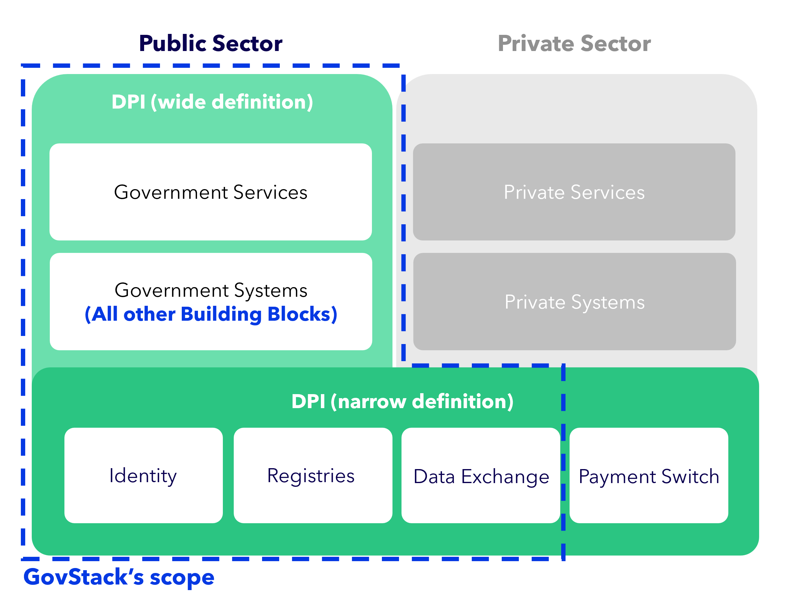

# Build a Digital Public Infrastructure (DPI)

### Purpose of the chapter 

This **chapter** is **designed for government leaders and teams who are responsible for shaping their country’s digital future**. Its purpose is to help understand what a “Digital Public Infrastructure” (DPI) is, why it matters for national development, and how specifically GovStack supports practical implementation of DPI when building or improving digital citizen services.

To support this, the chapter connects conceptual foundations with actionable guidance and is organized into the following sections:

* [**Digital Public Infrastructure: foundations, enablers, and national assessment**](./#digital-public-infrastructure-foundations-enablers-and-national-assessment)\
  Introduces the concept of DPI, its role as a foundational layer for digital societies, and the core components - digital identity, digital payments, and data exchange - that enable secure and trusted interactions at scale.
* [**The four layers of the DPI enabling environment**](./#the-four-layers-of-the-dpi-enabling-environment)\
  Explains the technical, legal, institutional, and societal conditions required for DPI to function reliably, safely, and in a people‑centric manner.
* [**How countries should assess DPI**](./#how-countries-should-assess-dpi)\
  Provides criteria for evaluating national readiness, diagnosing gaps, and determining whether core components, standards, and governance models are in place.
* [**DPI and GovStack**](./#dpi-and-govstack)\
  Explains how GovStack’s Building Blocks, reference architecture (PAERA), and technical specifications support countries in designing and implementing interoperable DPI - both narrowly (identity and data exchange) and broadly (full digital government infrastructure).
* [**GovStack’s design principles for interoperable and inclusive DPI**](./#govstacks-design-principles-for-interoperable-and-inclusive-digital-public-infrastructure)\
  Summarises the human‑centred, modular, privacy‑first, and open‑standards‑based design principles that guide GovStack’s DPI approach.
* [**How DPI unlocks scalable and inclusive e-government services** ](./#how-dpi-unlocks-scalable-and-inclusive-e-government-services)Shows how digital identity, payments, and data exchange become truly impactful when operationalised through services that people and institutions rely on.
* [**Examples of DPI**](./#examples-of-dpi)\
  Highlights real-world DPI implementations, such as Ukraine’s Diia and Kenya’s National Carbon Registry, showing how DPI functions in practice.
* [**Key activities for governments to enhance their DPI development**](./#key-activities)\
  Lists practical steps for governments to strengthen DPI, from DPI and digital services baseline assessments to standards and components alignment, as well as governance model development.
* [**Deliverables and success criteria**](./#deliverables-success-criteria)\
  Describes the outputs governments should produce when building DPI, including a DPI assessment report, gap analysis, prioritized service list, DPI architecture draft, and an implementation roadmap.

Together, these sections equip readers with a comprehensive guide to understanding, designing, assessing, and scaling Digital Public Infrastructure. This structure helps readers to quickly navigate to the content most relevant to their priorities.

### Digital Public Infrastructure: foundations, enablers, and national assessment 

The expression “Digital Public Infrastructure”, or in short DPI, refers to **shared digital systems, standards, and governance frameworks** which **facilitate secure and trusted interactions across a society** (UNDP, 2021).

DPI can thus be considered as a foundational layer, similar to a physical infrastructure that sustains the daily functioning of a society via roads, electricity, and water systems (CSIS, 2023) (c.f. YouTube video below). Similarly, DPI provides the key digital foundations on which both public and private services can operate. Its purpose is to facilitate that people, governments, and businesses can authenticate identities, exchange data in a safe manner, and conduct digital transactions at scale (G20, 2023).



In its most narrow definition, **DPI** is constructed around **three interconnected components** (Clark et al., 2025):

* **Digital identity:** Allows both individuals and organizations to uniquely identify and authenticate themselves online, which includes digital IDs, e-signatures, as well as civil registration systems.
* **Digital payment infrastructure:** Enables secure and interoperable financial transactions spread across the economy, ranging from government-to-person transfers to tax payments and subsidy distribution. _(Note: This key payment DPI component differs from the GovStack Payments Building Block, which essentially functions as a gateway between banking systems and services, rather than as an inter-institution payment system.)_
* **Data exchange & interoperable frameworks:** Allows information to move in reliable manner between institutions all while maintaining privacy and security. Some examples include secure data-sharing platforms, consent systems, as well as trust frameworks.


_However, while DPI is commonly described through the above-mentioned set of core components, these components should be understood as a **conceptual and aspirational reference**, rather than as a fixed or universally implemented baseline. Not all DPI components are foundational in every country context, nor are they necessarily fully in place at the outset of digital transformation. Instead, they represent a shared target state that governments progressively work towards, depending on institutional maturity, legal frameworks, and national priorities._


In a wider definition, at the G20 Summit of August 2023, **DPI** was defined as “**a set of shared digital systems** that **should be secure, interoperable,** and **can be built on open standards and specifications** to deliver and **provide** equitable **access to public and/or private services** at societal scale(…)” (G20, 2023). It thus acknowledges that **DPI is an “evolving concept”** and states that it **should be managed “by applicable legal frameworks and enabling rules”** in order to support certain goals like development and human rights (G20 2023). Hence, despite being frequently linked to identity, data interchange, and payment systems, a broader perspective on DPI is more suitable in a global setting (ECDPM, 2025).

Furthermore, for DPI to function sustainably and safely, the **implementing government must form a set of critical enabling conditions**. These include, for instance, **reliable connectivity, cloud and data-center infrastructure, strong cybersecurity**, as well as sufficient digital skills, digital capabilities, and digital literacy across the population. But also legal and regulatory frameworks are critical to safeguard data, establish responsibilities, and enable interoperability. Furthermore, at the Institutional level, well set up coordination, accountability, and engagement with civil society will both enable and maintain trust, as well as long-term resilience. These elements put together are ultimately establishing the environment, required for a robust, scalable, as well as people centric DPI.

#### **The four layers of the DPI enabling environment** 

Taken collectively, these prerequisites shape the enabling environment required for DPI to deliver its full value, which can be described across four mutually reinforcing layers:

1.Digital Infrastructure readiness

This layer delineates the technical foundations, including:

* **Connectivity availability** and affordability (UNDP, 2021); including access to **fixed broadband (fiber/DSL/cable)**, **mobile internet (3G/4G/5G)**, and **public or satellite options**where relevant, and whether **pricing and device costs** make these services realistically usable for people and institutions.
* **Cloud infrastructure** and data center capacity
* **Cybersecurity maturity** and critical infrastructure resilience (OECD, 2024)

2.Policy, legal, and regulatory frameworks

A complete DPI ecosystem necessitates layered policy instruments, which can be visualized through the legal framework pyramid (see figure below):

* **Soft law**, including international standards, guidelines, and technical specifications such as ISO standards (e.g. ISO 27001), ICAO guidelines, and ETSI standards
* **Regional/ International law**, such as the eIDAS 2.0 Regulation, GDPR, the Digital Markets Act, and the Digital Services Act.
* **National law** that is defining mandates, data rights, procurement rules, liability, standards compliance, and institutional responsibilities.

These layers together build the normative foundation for DPI.

<figure><figcaption>
Legal Framework Pyramid (GovStack 2025)
</figcaption></figure>

3.Governance and institutional arrangements

**Effective DPI** also **requires clear governance structures** to ensure coordination, accountability, and long-term sustainability. **These** **structures are reflected in models** such **as** the **GovStack’s government architecture framework** (PAERA [https://govstack.gitbook.io/paera](https://govstack.gitbook.io/paera)) (see figure below) and typically include:

* **Inter-ministerial governance bodies** that coordinate national DPI priorities, its rollout and evaluation.
* **Clear operator mandates** **defining who runs which components** and under what authority.
* **Decision-making architecture** that clarifies roles, responsibilities, and escalation plans.
* **Accountability mechanisms** for security, privacy, and standards compliance.

These governance pillars are showcasing how organizational and policy layers must align for DPI in order to scale effectively and operate in a secure and trusted manner.

<figure><figcaption>
Digital Governance Model (Source: Ivar Tallo &#x26; Aare Lapõnin)
</figcaption></figure>

4.People-centric systems &#x26; inclusion

Finally, **DPI must include safeguards** as well as **inclusion principles**, illustrated in the “Foundational and Operational DPI Safeguards Principle” graphic below and aligned with the UN’s Universal DPI Safeguards Framework [UN Universal Safeguards for Inclusive Digital Public Infrastructure](https://www.dpi-safeguards.org/). These emphasize the need to ensure:

* **data** is **not neutral** and **requires responsible stewardship**,
* **technological design** must **avoid** **embedding** or amplifying **bias**,
* **power asymmetries** must be **actively managed** through transparent governance,
* **infrastructure choices** inevitably **have uneven impacts**, making it **essential to design systems** that **minimize disparities** and promote equitable access.

Together, these principles ensure that DPI supports a safe, inclusive, and rights-preserving digital society.

<figure><figcaption>
Foundational and Operational DPI Safeguards Principle (GovStack 2025)
</figcaption></figure>


#### What is _not_ DPI?  

* An identity and authentication system restricted to a selected sub-group of a state’s population
* A payment infrastructure restricted to only private sector actors and its customers
* A data exchange restricted to only inner government data sharing


#### **How countries should assess DPI** 

Additionally, a practical DPI assessment must be conducted by every country aiming to engage in DPI activities, and it should examine the following:

* Whether core DPI components exist and if they are functional
* Whether the DPI components are interoperable across ministries
* Whether governance, standards, and legal frameworks are in place
* Whether institutions utilize shared components or maintain separate, siloed systems

### DPI and GovStack

**GovStack** is a **global initiative** that **empowers governments** to **design** and **build sovereign, interoperable** and **citizen-centric digital public sector services** and **infrastructure**. For a more in-depth explanation of how GovStack is enabling this by defining a government architecture and its reusable Building Blocks while avoiding fragmentation and vendor lock-in, please refer to the Implementation [Playbook section: _Introduction to GovStack._](#user-content-fn-1)[^1]

GovStack’s technical specifications support the practical implementation of DPI, recognising that DPI may be defined narrowly as **foundational service-enabling systems** (e.g. identity and data exchange) or more **broadly include the government systems and digital services** that build on these foundations. GovStack’s specifications describe implementations of DPI which are A) _owned_ (or strictly regulated) by the public sector and B) _used_ by the **public sector or those shared between the public and private sectors**. They do not define any components used exclusively by the private sector.

Following a **narrow definition** of DP&#x49;**,** GovStack offers a technical blueprint to build identity (“[Identity Building Block](https://identity.govstack.global/2-description)”) and data exchange (“[Information Mediator Building Block](https://mediator.govstack.global/)”) systems, which are considered core DPI components. The technical blueprint is being completed by GovStack guidance on governance, policy and domain-specific aspects: General guidance on interoperability and [Building Block-specific implementation guides](#user-content-fn-2)[^2].

Following a **wide definition** of DPI, GovStack’s full scope of a government architecture can be considered DPI. GovStack places citizens and businesses (the users) at the centre of digital transformation of government services. Therefore, the primary collective objective of all GovStack Building Blocks and entirety of a government’s system is to provide citizens with services. A wide definition of DPI includes these services and with that the whole of GovStack’s technical specifications. Why government-provided services are essential to DPI is explained below under [“Why Services Matter for DPI”](#user-content-fn-2)[^2].

<figure><figcaption>
Relation GovStack to DPI definitions
</figcaption></figure>


### What does GovStack _not_ offer?

* **Digital payment infrastructure:** What is usually described as “Digital Payment Infrastructure” in narrow definitions of DPI differs from the **GovStack Payments Building Block**, which primarily functions as a **gateway** between government-operated services and existing banking or payment systems, rather than serving as an **inter-institutional payment platform**.
* **Physical Infrastructure:** GovStack does not address the development of physical connectivity infrastructure, such as fibre-optic networks, mobile connectivity, or hardware provisioning, which are prerequisites for digital service delivery.
* **Policy and governance for private sector integration:** While the GovStack architecture anticipates interoperability with private sector solutions at the technical level, it does not currently provide guidance on policy or governance arrangements for integrating private sector actors.


### GovStack’s design principles for interoperable and inclusive digital public infrastructure 

GovStack is guided by [**human-centred design principles**](https://playbook.govstack.global/designing/service-design/govstack-design-principles), placing the needs, capabilities, and rights of users at the centre of digital public infrastructure. This includes ensuring that digital services are intuitive, accessible, and inclusive by design.

To support this, the framework emphasises designing for interoperability from the outset, using open standards and open APIs to ensure flexibility, and embedding privacy and security directly into systems architecture. Modularity and reusability are key principles to help countries avoid vendor lock-in and to enable systems to evolve over time.

These principles are further reinforced through our alignment with the Digital Public Goods Alliance (DPGA) and the DPI Safeguards stewarded by the UN ODET and UNDP, which emphasise openness, trust, accountability, and the protection of users’ rights across the design and implementation of digital public infrastructure.

### How DPI unlocks scalable and inclusive e-government services 

#### **Why services matter for DPI** 

While the **underlying digital rails** are **provided by DPI**, its **full potential** **is** only **realized** **when** it is **applied** **to** **deliver specific services** that institutions and citizens depend on. In fact, e-government services operationalize DPI’s capabilities and convert them into useful results. Without DPI, digital services can still exist, but they remain siloed, hard to scale, and expensive to maintain.

Thus, e-government services are filling this absence by integrating DPI’s core components, namely, digital identity, payment mechanisms, and data exchange into daily interactions.

Some examples:

* A **digital identity system** achieves its full potential when it facilitates a citizen’s ability to register a birth, renew a driver’s license, or access health records (CSIS, 2023).
* **Payment infrastructure** proves its value by enabling welfare transfers, tax collection, and government disbursements with enhanced speed and transparency (CSIS, 2023).
* **Data exchange platforms** are generating impact by supporting health information systems, property registration, or business licensing (CSIS, 2023).

In addition to operationalizing DPI, **e-government services** also **propel** **user adoption** and **drive public trust**. When services are particularly well-designed and reliable they enhance confidence in the underlying digital infrastructure and simultaneously drive citizen’s digital engagement. Moreover, services that are based on a shared infrastructure drive interoperability across government institutions, as they help ministries to adopt standards, reduce duplication, streamline operations, and provide coherent services across multiple sectors.

Ultimately, **DPI-enabled services yield** both **efficiency gains**, as well as **societal benefits**. By reusing shared digital components, costs can be reduced, implementation timelines shortened, and service quality tremendously improved (Clark et al., 2025). Additionally, digital services that are assembled on strong DPI foundations can enhance access to key services, lower administrative burdens, and foster inclusion, especially for underserved populations. Hence, e-government services serve as a key driver to modernizing the public sector, as well as the broader digital development.

This means that **whenever digital services are being built** by governments, **DPI principles must be followed** (interoperability, reusability, shared infrastructure) – enabling that the services can scale across ministries and truly support national digital development.

#### **How DPI powers different types of e-government services** 

A wide range of **e-government services** tremendously **depend** **on** the specific **capabilities** that are being **provided by** the **DPI –** including digital identity, and authentication, secure digital payments, consent and authorization mechanisms, interoperable data exchange, and core registries that enable services to reliably access and verify information.

These services can be broken down into three broader categories:

1.Identity-enabled services

The **first category** depicts **identity-enabled services** (See figure below), just as civil registration, driver’s licensing, voter enrollment, access to health or education portals, as well as enrollment in social protection schemes. These services tremendously rely on secure identification and authentication in order to verify eligibility, enable accuracy, and enhance access to sensitive information.

<figure><figcaption>
(Clark et al., 2025)
</figcaption></figure>

2.Payment-enabled services

The **second category** contains **payment-enabled services** (See figure below), i.e. services like welfare transfer, tax or free payments, subsidy distribution, insurance contributions, and government transactions with suppliers or citizens. Payment rails enable processes to be faster, more transparent, and less prone to leakage or fraud.

<figure><figcaption>
(Clark et al., 2025)
</figcaption></figure>

3.Data-driven services

The **third category** encompasses relevant **data-driven services** (See figure below), e.g., electronic health records, land and property registration, business licensing systems, and agricultural advisory platforms. These specific services heavily rely on secure data exchange and consistent registries in order to supply precise and timely information.

<figure><figcaption>
(Clark et al., 2025)
</figcaption></figure>

However, across all categories **cross-cutting digital services are actively reinforcing** **both** the **functionality** and **integrity** of **e-government services**. These can consist of, for example, digital signatures, digital wallets, e-KYC mechanisms, and secure messaging services. Together, these specific services demonstrate how DPI actively supports diverse cases via shared, reusable foundational capabilities.

### Key activities for governments to enhance their DPI development 

* Run a DPI and digital services baseline assessment
* Map existing national digital system and identify emerging gaps
* Conduct a prioritization on which DPI components require investment or modernization
* Detect high-impact services that are depending on DPI
* Align ministries around shared components as well as technical standards
* Develop governance and operational models in order to manage a shared national infrastructure

### Deliverables/Success criteria for countries' DPI Development 

* DPI assessment report and maturity overview
* Gap analysis of foundational systems, as well as enabling conditions
* List of prioritized of DPI-enabled services to build or revamp
* Draft of a national DPI architecture that is aligned with the GovStack Building Blocks
* Implementation roadmap that includes roles and responsibilities, timelines, governance and standards (see "Digital Strategy chapter” for an in-depth Implementation roadmap).

While national DPI systems form the backbone of digital service delivery, their transformative potential fully unfolds only when they are designed to operate across borders. Building on this foundation, the following subchapter examines cross-border DPI in the East African Community, focusing on how interoperability, regional governance, and shared infrastructure enable digital integration at scale.&#x20;

[^1]: ADD LINK

[^2]: ADD LINK
