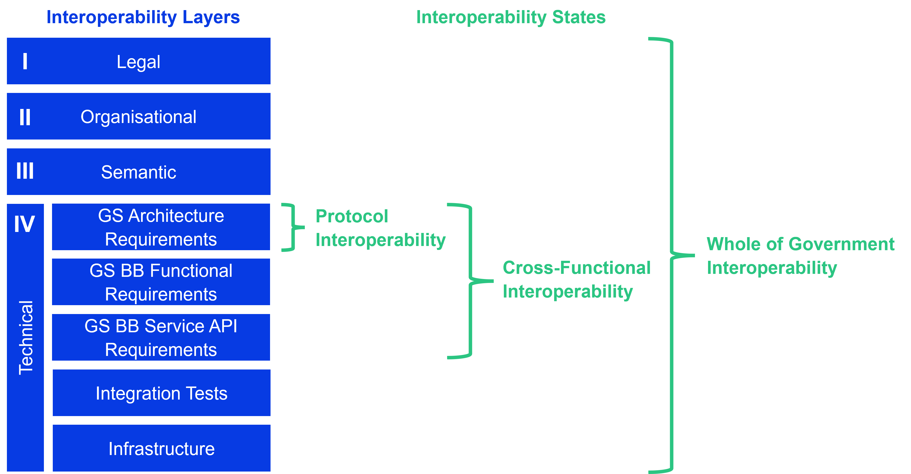

# Establish Interoperability


If you have limited time and this chapter feels too long, use the **AI GitBook Assistant** by clicking the “Ask” button on the top-right corner for a quick summary of this chapter.



## Introduction

This chapter explains **what interoperability means** in the context of digital public services, **why it is a critical enabler of digital transformation**, and **how it can be operationalised** through structured frameworks, governance mechanisms, and technical standards. The chapter uses the **European Interoperability Framework (EIF)** as its **primary conceptual reference model** for understanding interoperability, particularly its layered approach spanning legal, organizational, semantic, and technical dimensions. The EIF is applied throughout the chapter to structure the analysis, terminology, and governance considerations, while GovStack complements it with implementation‑oriented guidance and a maturity‑based perspective.

The chapter is structured as follows:

* [**What is interoperability?**](establish-interoperability.md#what-is-interoperability)\
  Defines interoperability in the context of e‑government, explaining how public administrations exchange data and information in a meaningful, lawful, and effective way.
* [**Why is interoperability needed?**](establish-interoperability.md#why-is-interoperability-needed)\
  Explains why modern digital public services depend on interoperability and how the absence of it leads to fragmentation, inefficiency, and limited scalability.
* [**How to operationalise interoperability?**](establish-interoperability.md#how-to-operationalise-interoperability)\
  Introduces global and national interoperability frameworks, with the EIF serving as the main reference point for structuring interoperability efforts.
* [**Interoperability layers**](establish-interoperability.md#interoperability-layers)\
  Presents the layered interoperability model, largely derived from the EIF, and explains why alignment across legal, organizational, semantic, and technical layers is essential.
* [**GovStack’s interoperability continuum**](establish-interoperability.md#govstacks-interoperability-continuum)\
  Extends the EIF’s layered model with a maturity‑based progression that helps governments understand how interoperability evolves in practice.
* [**Best practice examples**](establish-interoperability.md#best-practice-examples)\
  Illustrates how interoperability has been implemented in practice across different national contexts.
* [**Recommendations of the European Interoperability Framework (EIF)**](establish-interoperability.md#recommendations-of-the-european-interoperability-framework)\
  Examines the EIF’s principles, governance model, and recommendations in more detail, highlighting their relevance for public‑sector interoperability.
* [**Interoperability governance and integrated public service governance**](establish-interoperability.md#interoperability-governance)\
  Describes how the EIF frames governance as a cross‑cutting requirement to ensure coherence, sustainability, and accountability.
* [**Legal, organizational, semantic, and technical interoperability**](establish-interoperability.md#legal-interoperability)\
  Applies the EIF layers in depth, outlining concrete measures and challenges at each level.
* [**The Interoperable Europe Act**](establish-interoperability.md#the-interoperable-europe-act)\
  Explains how the EIF has evolved from a voluntary framework into a legally binding reference through the Interoperable Europe Act, with implications for compliance and governance.

Together, these sections provide a structured guide to understanding, governing, and implementing interoperability as a core capability of digital government. The chapter positions the EIF as the **conceptual backbone** for interoperability, while GovStack provides the **practical tools and specifications** needed to implement interoperability in real‑world digital public services.

## What is interoperability?

**Interoperability** depicts the **ability of organisations, systems, and services to work together** by exchanging data and information in a meaningful, lawful, and effective manner. In the context of digital public services, interoperability allows public administrations to cooperate across institutional, sectoral, and jurisdictional boundaries while keeping their organisational and legal autonomy.

According to the “Interoperability Framework for e-Government” (IFEG), interoperability in e-governance is defined as&#x20;

> “the ability of different systems from various stakeholders of e-governance to work together, by communicating, interpreting and exchanging the information in a meaningful way”&#x20;
>
> ([IFEG, 2015](https://egovstandards.gov.in/sites/default/files/2021-07/Interoperability%20Framework%20For%20e-Governance%20\(IFEG\)%20Ver.1.0.pdf)).

More broadly, interoperability enables organisations to interact in pursuit of mutually beneficial objectives by sharing information and knowledge through the business processes they support, facilitated by the exchange of data between their Information and Communication Technology (ICT) systems.

## Why is interoperability needed?

Digital public services rarely rely on a single system or authority. Instead, they are comprised of multiple administrative actors, information systems, and data sources that **must interact consistently over time**. Thus, interoperability ensures that these interactions are predictable, reusable, and scalable. Without it, digitalisation efforts tend to result in fragmented solutions, duplicated systems, as well as manual coordination mechanisms that weaken efficiency and service quality.

As governments worldwide accelerate the digitalization of public services, **optimizing interoperability** becomes a critical enabler for delivering reliable, transparent, and seamless digital public services. By leveraging proven solutions from other stakeholders, interoperability enhances efficiency, supports cost savings through simplification and automation of service delivery processes, and improves access to e-government services across borders ([Campmas, Iacob, & Simonelli, 2022).](https://www.cambridge.org/core/journals/data-and-policy/article/how-can-interoperability-stimulate-the-use-of-digital-public-services-an-analysis-of-national-interoperability-frameworks-and-egovernment-in-the-european-union/62ACD1B9160C3ABF7AF6CF637B1A124C)

Conversely, a **lack of interoperability** can impede the development of new technologies and increase administrative burdens due to restricted data flows within the public sector. Ultimately, it can hinder the digital transformation of public administrations both within and across countries. To effectively support the digitalization of public services, interoperability initiatives must address persistent challenges such as administrative silos, inefficient use of resources, limited coordination among public service delivery units, incompatibilities between information technologies, organizational fragmentation, legacy processes, and legal constraints ([Campmas, Iacob, & Simonelli, 2022).](https://www.cambridge.org/core/journals/data-and-policy/article/how-can-interoperability-stimulate-the-use-of-digital-public-services-an-analysis-of-national-interoperability-frameworks-and-egovernment-in-the-european-union/62ACD1B9160C3ABF7AF6CF637B1A124C)

Therefore, interoperability functions as an enabling condition for digital government: It grants public administrations to design services once and operate them across multiple contexts, rather than rebuilding similar capabilities repeatedly.

## How to operationalise interoperability?

Interoperability has been conceptualized through a variety of global and national frameworks that provide structured guidance on aligning legal, organizational, semantic, and technical aspects of data exchange and service integration across domains and jurisdictions. These include cross‑sector e‑government frameworks (e.g. [European Interoperability Framework](https://ec.europa.eu/isa2/sites/default/files/eif_brochure_final.pdf); [India’s Interoperability Framework for e‑Governance](https://egovstandards.gov.in/sites/default/files/2021-07/Interoperability%20Framework%20For%20e-Governance%20\(IFEG\)%20Ver.1.0.pdf)), sector‑specific models (such as the [interoperability framework for the European Health Data Space](https://www.european-health-data-space.com/) or the [World Bank’s ID4D guidance on interoperable digital ID systems](https://id4d.worldbank.org/guide/interoperability)), and generic reference architectures promoted by international organizations (e.g. [World Bank ID4D](https://id4d.worldbank.org/guide/standards), various national interoperability reference architectures), which together offer a rich repertoire of principles, patterns, and standards that public administrations can draw on when designing interoperable digital public services.&#x20;

The recommendations of the EIF on how to achieve interoperability are in-depth explained in the  chapter ["Recommendations of the European Interoperability Framework"](establish-interoperability.md#recommendations-of-the-european-interoperability-framework).

### Interoperability layers

Frameworks and reference architectures defines layers of interoperability slightly different, but commonalities can be easily seen:

| European Interoperability Framework | India's Interoperability Framework for e-Governance | ISO/IEC 21823-1:2019 Interoperability of IoT systems            |
| ----------------------------------- | --------------------------------------------------- | --------------------------------------------------------------- |
| Technical Interoperability          | Technical Interoperability                          | 
Transport Interoperability Syntactic Interoperability
 |
| Semantic Interoperability           | Semantic Interoperability                           | Semantic Interoperability                                       |
| Organisational Interoperability     | Organisational Interoperability                     | Behavioral Interoperability                                     |
| Legal Interoperability              |                                                     | Policy Interoperability                                         |

This layered model mirrors the reality that technical connectivity alone is insufficient. Sustainable interoperability necessitates concrete alignment of mandates, processes, data meanings, and institutional responsibilities.

### GovStack's interoperability continuum

**GovStack complements the European Interoperability Framework (EIF)** by[ **adding a maturity-based perspective**](https://govstack.global/news/achieving-technical-interoperability-in-government-systems-from-protocol-to-whole-of-government/) to its layered model of interoperability. While the ElF defines what dimensions must be aligned, GovStack introduces a progression model that helps governments understand how interoperability evolves in practice.

As a foundation, the EIF conceptualises interoperability across four core layers:

* **Legal interoperability** - Ensures that legislation, regulations, and policy frameworks enable lawful cross-border and cross-sector data exchange.
* **Organisational interoperability** - Aligns institutional mandates, governance structures, and business processes across public authorities.
* **Semantic interoperability** - Establishes shared data models, definitions, and standards so that exchanged information is interpreted consistently.
* **Technical interoperability** - Enables systems to exchange data through agreed technical standards, interfaces, and protocols.

(The EIF further includes additional layers, which are discussed in more depth in the [ElF Recommendation section](establish-interoperability.md#recommendations-of-the-european-interoperability-framework).)

Building on these dimensions, GovStack defines interoperability as a **continuum of three progressively more comprehensive states**, guiding countries from basic technical connectivity toward full whole-of-government alignment (see figure below):

* **Protocol interoperability** – systems can technically exchange data using shared 
protocols
* **Cross-functional interoperability** – systems implement common Building Block APIs and functional specifications
* **Whole-of-government interoperability** – organisational, legal, semantic, and technical standards are aligned and governed at system level (c.f. in depth guidance in the [PAERA report](https://paera.govstack.global/))

GovStack Building Blocks, architecture requirements, and reference specifications are designed to assist countries in moving deliberately along this continuum, avoiding vendor lock-in and fragmented systems.

<figure><figcaption>
GovStack's three maturity states increasingly include more interoperability layers (GovStack, 2025)
</figcaption></figure>

GovStack's technical specifications are aimed towards achieving **technical interoperability**. Technical interoperability focuses on the ability of systems to connect and exchange data. To provide this ability, GovStack's specification offer cross-functional requirements and API services as a blueprint. While technical interoperability is treated as an independent layer in GovStack, it needs to be **emphasized** that an actual implementation **must be designed** in **alignment with organizational, legal, and semantic interoperability** from the outset.

To support this, **GovStack provides** a **structured and standardized approach** **to** **technical interoperability** **through** its **Building Block (BB) specifications and** associated **architecture requirements**. These specifications aim to ensure consistent implementation, reuse, and substitutability of software components across services and jurisdictions, while avoiding tightly coupled, point-to-point integrations. In this way, GovStack translates general interoperability principles into concrete, implementable guidance for digital public service delivery.

To operationalize this approach, GovStack decomposes technical interoperability into the requirement specification categories provided by [GovStack architecture and Building Block specifications](https://specs.govstack.global/). It separates technical interoperability into five specific component requirements: Architecture Requirements, Building Block Functional Requirements, Service API Requirements, Integration Tests, and Infrastructure (see figure above).

By fulfilling these specific requirements, **GovStack defines three maturity states** that progressively increase the scope and resilience of interoperability:

1.Protocol interoperability

This is the baseline state where systems can technically exchange data using shared protocols.

* **Definition:** Systems agree on how data is exchanged (e.g. using REST API), but the functional meaning remains specific to the two systems involved.
* **Requirements:** This state relies primarily on adhering to GovStack Architecture Requirements (especially cross-cutting requirements), ensuring that basic connectivity standards are met.

2.Cross-functional interoperability

This higher maturity state ensures that systems not only exchange data but also share a common understanding of how data is used in business processes. As a result, components that implement the same agreed behaviour can be substituted for one another without disrupting the overall service.

* **Definition:** Systems implement common Building Block specifications. For instance, two different implementations of the Identity Building Block may both expose an authentication API and comply with the same specification, even if the set of registered citizens differs between them. Cross-functional interoperability is achieved because one Identity implementation can be replaced by another without disrupting the overall service.
* **Requirements:** In GovStack, this state is achieved when all participating systems comply with the GovStack architecture requirements, particularly the cross‑cutting requirements, and when each participant implements the GovStack Building Block service API specifications.

3.Whole-of-government interoperability

Whole‑of‑government interoperability is reached when all parties agree not only on how data is exchanged, but also on how it is used.

* **Definition:** Technical systems are not only connected and functionally aligned but are also governed by a consistent legal and organizational framework.
* **Requirements:** In GovStack, this state is achieved when all participants fulfil the GovStack architecture requirements, especially the cross‑cutting requirements in chapter 5, and implement the GovStack Building Block service API specifications, while government‑wide organizational, legal and semantic standards are in place, supported by GovStack’s PAERA document.

More information can be found at GovStack's blog post: [Achieving technical interoperability in government systems: From Protocol to Whole-of-Government ](https://govstack.global/news/achieving-technical-interoperability-in-government-systems-from-protocol-to-whole-of-government/)

## Best practice examples

This section presents **selected country-level examples** that **illustrate how interoperability has been implemented** **in practice** as a foundation for scalable and resilient digital public infrastructure. The cases highlight different national approaches to interoperability, reflecting varying institutional contexts, governance models, and stages of digital maturity.

While the specific architectures and policy instruments differ, the examples demonstrate common principles such as the use of open standards, shared digital building blocks, and coordinated governance across technical, organizational, legal, and semantic layers. Together, these cases provide practical insights into how interoperability can enable cross-sector integration, service reuse, and inclusive digital transformation at scale.



**India: Interoperability as the foundation of scalable Digital Public Infrastructure**

India’s digital governance success can be attributed to the interoperable, open‑standards‑based Digital Public Infrastructure (DPI) architecture, built at population scale. The key Building Blocks (BBs), which are referred to as “[India Stack](https://indiastack.org/index.html)”, include, but not limited to, issuing digital IDs (Aadhaar), improving financial inclusion through Jan Dhan, and digitizing payments on the Unified Payments Interface (UPI). Through a robust policy framework that focuses on data privacy and empowerment, mandates interoperability of digital assets and transactions (detailed in the [Interoperability Framework for e-Governance (IFEG](https://egovstandards.gov.in/sites/default/files/2021-07/Interoperability%20Framework%20For%20e-Governance%20\(IFEG\)%20Ver.1.0.pdf))), and encourages market participation – India’s DPI has transformed the country’s financial inclusion metrics enabling India in progressing towards achieving the Sustainable Development Goals (SDGs) [(ORF, 2025).](https://www.orfonline.org/research/digital-public-infrastructure-as-a-catalyst-for-private-sector-innovation)

Interoperability has enabled collaboration across sectoral digital ecosystems in areas such as health, agriculture, commerce, and mobility, supported by public-private partnerships and guided by institutions including the Centre for Digital Public Goods at IIM Bangalore and Protean eGov Technologies. These multi‑sector “Open Digital Ecosystems” exhibit how shared protocols and registries support the alignment between agencies and industries and further facilitate the integration across domains [(State of DPI in India, 2025).](https://www.iimb.ac.in/cdpg/pdf/State-India-DPI_Report.pdf)

India's efforts to digitize its healthcare ecosystem – particularly through the Ayushman Bharat Digital Mission (ABDM) – illustrate how standardized data schemas, digital health identifiers, and interoperable electronic health records can support large-scale, data-driven innovation. These measures have contributed to improved accessibility, affordability, and quality of care. Supported by strong public-private collaboration, interoperability and standardization have enabled the scaling of healthcare models that bridge rural-urban gaps and strengthen overall system resilience [(PIB, 2025). ](https://www.pib.gov.in/PressNoteDetails.aspx?NoteId=153675\&ModuleId=3\&reg=3\&lang=2)

The World Economic Forum has identified India as a potential “global pathfinder” in digital health interoperability, highlighting its approach as an adoptable and replicable model for countries seeking to develop unified, citizen-centric health architectures [(WEF,2025).](https://www.weforum.org/stories/2025/01/india-can-be-a-global-pathfinder-in-digital-health-here-s-how/) In line with this assessment, India’s combination of interoperable digital foundations and strong public-private collaboration has enabled the scaling of healthcare models that bridge rural-urban gaps and enhance overall system resilience.

In this video, one can take a closer look at India Stack. Through its interoperable digital payment systems and core building‑block technologies, India is not just addressing financial inclusion, it is tackling key developmental issues with scalable, technology‑driven solutions.



(CGAP, 2017)



**Singapore: Interoperability through National Digital Identity and Whole‑of‑government data architecture**

Singapore’s digital government model is built on the vision of creating a state that is “Digital to the Core, and Serves with Heart,” assisted by secure, interoperable digital infrastructure, thereby, facilitating seamless public‑service delivery. This vision is operationalized through the Digital Government Blueprint and Smart Nation frameworks, which outline cross‑agency coordination, standardized digital service requirements, and long‑term strategic alignment [(MDDI, 2025). ](https://www.mddi.gov.sg/what-we-do/digital-development/digital-government/)&#x20;

The national Digital Identity (NDI), known as “Singpass” and the government wide data sharing platform API exchange (APEX) are two important layers of the Singaporean ‘Digital Stack’. These platforms allow secure cross‑agency data sharing and enable access over 2,000 public and private services [(World Bank Blogs, 2022)](https://blogs.worldbank.org/en/digital-development/how-singapores-national-digital-identity-and-government-digital-data-sharing). Semantic and technical interoperability is strengthened and operationalized through Singapore’s Government Data Architecture (GDA), by establishing Single Sources of Truth, secure data access platforms, and whole-of-government data distribution mechanisms. These structures facilitate cross-agency data sharing, reduce timelines from months to just weeks, while ensuring responsible and trustworthy use and reuse of data [(Psd.gov.sg, 2020).](https://psdchallenge.psd.gov.sg/ideas/work-better/ask-a-pro-using-data-securely)&#x20;

Singapore’s integrated digital ecosystem fosters scalable innovation, facilitates crossborder data and financial flows, through applications like “Corppass” (for international business transactions) and allows for consistent, citizen-centric digital experiences across agencies. Through interoperability-by-design and the coordinated use of platforms like Singpass, MyInfo, and the API Exchange (APEX), the country has achieved near universal digital transactions and positioned itself as a global leader in secure, unified digital governance  [(World Bank Docs, 2025)](https://thedocs.worldbank.org/en/doc/033a79cc8233622769bc381d16c661b7-0090012025/original/03-Feng-Ji-Sim-World-Bank-Event-Plenary-Session.pdf).&#x20;



(Government Technology Agency of Singapore, 2019)



**Rwanda: An interoperability model driving continental digital integration**

Rwanda’s e-government transformation is steered by the Rwanda Government Enterprise Architecture (RGEA), which outlines the standardization of system design, integration, and management across public institutions. Its digital development agenda, rooted in National Information and Communication Infrastructure (NICI) Plans, the Smart Rwanda Master Plan, and Vision 2050, prioritizes interoperability to enable seamless service delivery across governance, health, education, finance, and agriculture. The country’s robust institutional alignment and international partnerships, for example, with JICA and South Korea’s NIA, further emphasize its promise to building integrated, interoperable systems ([Center for African Studies, 2025](https://e-governancehub.ru/wp-content/uploads/2025/07/E-Governance-in-Rwanda-2025-%E2%80%94-2025-05-16.pdf)).

The launch of the Center for Digital Public Infrastructure in 2025 indicates an important step in aligning Rwanda with global DPI standards, accelerating the development of secure, open, and interoperable digital systems. The Center serves as a dynamic testbed for emerging DPI solutions, allowing pilot innovations and refinement of new technologies before deploying them for large scale implementation ([Rwanda Information Society Authority, 2025](https://www.risa.gov.rw/news-detail/rwanda-launches-the-center-for-digital-public-infrastructure-a-new-era-of-innovation-and-inclusion)). This will encourage cross-border interoperability, financial inclusion, scalable digital identity and payment infrastructures. IremboGov, Rwanda’s integrated e-government platform, complements these efforts by processing hundreds of thousands of applications monthly and relying  on interoperable payment and identity layers [(International Center for Tax and Development, 2025](https://www.ictd.ac/blog/bridging-the-divide-rwandas-quest-for-equitable-digital-governance/)).&#x20;

Rwanda is advancing as a regional hub ([Modern Diplomacy, 2025](https://moderndiplomacy.eu/2025/08/04/africas-smart-state-inside-rwandas-digital-governance-model/)) for cross-border interoperability through initiatives such as the “Africa’s First Fintech License Passport Framework” with Ghana, which aims to engage in cross-border payment flows in a secure, instant, and low-cost fashion, by utilizing next‑generation DPI infrastructure ([Global Finance & Technology Network \[GFTN\], 2025](https://gftn.co/press/ghana-and-rwanda-to-implement-africas-first-fintech-license-passport-framework)). Furthermore, Rwanda’s efforts to link payments Tanzania’s instant payment system demonstrates its commitment to interoperability as a tool for regional integration and economic development [(East African Community, 2025)](https://www.eac.int/eadrip-news-updates/eardip-press-releases/3457-eac-begins-building-regional-instant-payment-network-with-rwanda-tanzania-pilot).&#x20;

The video below illustrates Rwanda’s journey toward Vision 2050, highlighting how the country is leveraging digital infrastructure, digital services, and innovation to foster interoperable systems and data-driven policies that support inclusive, citizen-centric public services.



(MINICT Rwanda, 2025)



## Recommendations of the European Interoperability Framework

Within this [broader landscape](establish-interoperability.md#how-to-operationalise-interoperability), the European Interoperability Framework (EIF) stands out as a particularly influential and mature example, not only because of its clear layered model of interoperability but also because it has served as a template for many national interoperability frameworks and is used for GovStack's conceptualization of interoperability.

The European Interoperability Framework (EIF) delineates interoperability as the ability of organisations to work together towards mutually beneficial goals by exchanging information as well as knowledge.

EIF uses conceptualises interoperability across four core layers (see also comparison in chapter [Interoperability Layers](establish-interoperability.md#interoperability-layers)):

* **Legal interoperability**
* **Organisational interoperability**
* **Semantic interoperability**
* **Technical interoperability**

In addition, EIF introduces:

* **Interoperability governance** as a background layer safeguarding coherence, sustainability, and accountability
* **Integrated public service governance** as a cross-cutting component that binds all layers together in the delivery of end-to-end public services

<figure><figcaption>
(European Union, 2017)
</figcaption></figure>

### Underlying principles of European public services

The **European Interoperability Framework establishes 12 underlying principles** (see figure below) that **guide** the **design and implementation of public services**. These principles serve as behavioural recommendations, ensuring that services are not just technically connected but are also sustainable, user-friendly, and open.

Administrations are advised to apply these principles whenever they design new services or update existing ones:

1.Subsidiarity and Proportionality

EU-level action should only be taken when it is more effective than national action alone. National frameworks should be aligned with the EIF but tailored to specific national needs.&#x20;

2.Openness

Administrations should publish data as open data and encourage the use of open-source software and open specifications to avoid vendor lock-in and foster innovation.&#x20;

3.Transparency

Citizens and businesses must have visibility into administrative processes and the data held about them. This includes ensuring internal systems have interfaces exposed for external scrutiny where appropriate.&#x20;

4.Reusability

Before developing new solutions, administrations should check if existing solutions (software, data, or frameworks) can be reused. This saves costs and improves quality.&#x20;

5.Technological Neutrality and Data Portability

Services should not impose specific proprietary technologies on users. Data must be easily transferable between different systems to prevent lock-in.&#x20;

6.User-Centricity

Services must be designed around the user’s needs, not the administration’s structure. This includes offering multiple delivery channels (digital and physical) and asking for information only once ("Once-Only Principle").

7.Inclusion and Accessibility

Digital services must be accessible to everyone, including the elderly and people with disabilities, ensuring no one is left behind by the digital transition.&#x20;

8.Security and Privacy

Citizens' data must be processed in full compliance with privacy laws. Security measures must be proportionate to the risks involved.&#x20;

9.Multilingualism

Services should be available in languages understood by the target users, crucial for cross-border mobility within the EU.

10.Administrative Simplification

Digitalization should be used to reduce the administrative burden (red tape, i.e. excessive bureaucracy or adherence to official rules and formalities) for citizens and businesses, streamlining processes rather than just digitizing existing bureaucracy.&#x20;

11.Preservation of Information

Administrations must ensure that digital records and data are preserved and remain accessi-ble over the long term, despite technological obsolescence.

12.Assessment of Effectiveness and Efficiency

Existing and new services should be regularly evaluated to ensure they deliver value for money and benefit the user.

<figure><figcaption></figcaption></figure>

### Interoperability governance

<figure><figcaption>
(European Union, 2017)
</figcaption></figure>

Interoperability governance forms the background layer of the European Interoperability Framework (EIF). The following section is especially relevant for **accountability and rights protection.**

It **encompasses the frameworks, institutional arrangements, organizational structures, roles, policies, and agreements** that **guide how interoperability is achieved**, maintained, and monitored at national, crossborder, and for instance EU levels.&#x20;

#### 1) Secure political support and clear prioritisation

Interoperability efforts take place in complex, evolving administrative and policy environments. Sustained political commitment is essential to enable crosssectoral and crossborder collaboration, ensure shared objectives, and align timelines and priorities. Successful implementation requires governments to assign sufficient resources, leadership attention, and dedicated capabilities across all levels of administration.&#x20;

However, a critical barrier remains the lack of inhouse interoperability skills. Member States should thus embed workforce development into their interoperability strategies, recognizing that delivery requires multidisciplinary expertise across legal, organizational, semantic, and technical areas.&#x20;

#### 2) Ensure sustainability and a holistic approach

Furthermore, many public services depend on shared components and common interoperability agreements. Their sustainability must be guaranteed beyond individual projects or political cycles. Because these components originate from work across local, regional, national, and EU entities, coordination and monitoring require a holistic, multi‑level governance approach. Interoperability governance brings together the necessary instruments – including policies, standards, agreements, and monitoring mechanisms – to ensure this coherence.&#x20;

For example, the European Commission supports this through mechanisms such as the [National Interoperability Framework Observatory (NIFO)](https://interoperable-europe.ec.europa.eu/interoperable-europe/nifo), which enables countries to share experiences, monitor progress, and align national frameworks (NIFs) with the EIF.

#### 3) Identify and select standards and specifications

But also standards and specifications underpin interoperability – and hence effective management requires a structured lifecycle approach:

1. **Identify** candidate standards based on concrete needs.
2. **Assess** them using transparent, objective, and nondiscriminatory methods.‑discriminatory methods.
3. **Implement** the selected standards following clear guidelines.
4. **Monitor compliance** with established requirements.
5. **Manage changes** systematically when standards evolve.
6. **Document standards** in open, consistently described catalogues.

Standards can be mapped to the [EIRA](https://interoperable-europe.ec.europa.eu/collection/european-interoperability-reference-architecture-eira/solution/eira) and catalogued in the [European Interoperability Cartography (EIC)](https://interoperable-europe.ec.europa.eu/collection/cartography/solution/european-interoperability-cartography-eic) to improve visibility and reuse.

Where suitable standards do not exist, public administrations should actively participate in standardisation processes to ensure alignment with public sector needs and to keep pace with technological innovation.

EIF summarized recommendations - Interoperability governance

To ensure sustainability and overcome administrative silos, **the EIF recommends** that EU Member States:

* **Ensure holistic governance of interoperability** activities across administrative levels and sectors.
* **Establish processes to select, evaluate**, implement, monitor, and validate **standards** and specifications.
* **Use a structured,** transparent, cross-border aligned **approach** to **assess and select standards**, reflecting EU recommendations.
* When procuring or developing ICT solutions, **consult relevant national and EU catalogues**, NIFs, and domain specific interoperability frameworks (DIFs), when procuring or developing ICT solutions‑specific frameworks.
* **Engage in standardization work** relevant to your needs to help shape standards and ensure they meet public service requirements. 

To gain a broader understanding of rights‑related safeguards, including privacy, transparency, legal certainty, and user protection, also refer to the sections:&#x20;

* [Underlying principles of European public services](establish-interoperability.md#underlying-principles-of-european-public-services)
* [Legal interoperability](establish-interoperability.md#legal-interoperability)
* and the [Interoperable Europe Act](establish-interoperability.md#the-interoperable-europe-act)

### Integrated public service governance

<figure><figcaption>
(European Union, 2017)
</figcaption></figure>

European public services are often the result of aggregating services provided by different public administrations. For these services to function effectively, it is insufficient to rely solely on technical connectivity; instead it is imperative to include all layers: legal, organizational, semantic and technical. It is an **ongoing effort** to **ensure interoperability** in the preparation of legal instruments, organizational business processes, information exchanges, and the services and components that support European public services. Interoperability is repeatedly challenged by changes in the surrounding environment, such as new or amended legislation, evolving needs of businesses and citizens, reorganizations within public administrations, modifications to business processes, and the emergence of new technologies.

#### 1) Ensure sustainability and coordination

The EIF establishes that integrated public service provision requires a formal governance structure. This structure is essential to ensure that coordination is maintained over time rather than relying on ad-hoc cooperation.

According to the framework, this governance structure should cover, as a minimum:

* The **definition of organizational structures**, roles and responsibilities, and the decision-making process for the stakeholders involved.
* The **establishment of clear requirements** for key interoperability aspects (such as quality, scalability, availability and reusability) covering both internal building blocks and external information/services, and their translation into explicit, enforceable service level agreements.
* A **change management plan** to define the procedures and processes for dealing with and controlling changes.
* A **business continuity and disaster recovery plan** that ensures digital public services and their building blocks remain operational under various circumstances, such as cyberattacks or the malfunction of specific building blocks.

#### 2) Incorporate interoperability agreements

Furthermore, in order to formalize the cooperation between different administrative entities, the EIF emphasizes the use of Interoperability Agreements. These agreements serve as the primary instrument for defining the relationships and obligations between the parties involved. Creating and maintaining these agreements is part of the overall governance of public services. These agreements should be specific enough to support the joint provision of services, while still allowing each organization as much internal and national autonomy as possible. At semantic and technical levels, and in some cases also at organizational level, such agreements typically refer to standards and specifications. At the legal level, they can be made concrete and binding through EU or national legislation, or through bilateral and multilateral arrangements.

Other types of agreements can supplement these interoperability agreements by addressing day‑to‑day operational issues. Examples include memoranda of understanding (MoUs), service level agreements (SLAs), and documents describing support and escalation procedures and contact points. Where relevant, these operational instruments can refer back to the underlying semantic and technical agreements.

Because the delivery of a European public service depends on the combined contributions of different parties that provide or consume parts of the service, it is essential that interoperability agreements incorporate appropriate change management processes. These processes help to safeguard the accuracy, reliability, continuity and ongoing evolution of the services provided to other public administrations, businesses and citizens.

EIF summarized recommendations - Integrated public service governance

Consequently, to secure the interaction between parties, the **EIF advises that** administrations:

* **Ensure interoperability and coordination** over time when operating and delivering integrated public services by putting in place the necessary governance structure.
* **Establish interoperability agreements** in all layers while complementing them with clear operational agreements and change management processes.

### Legal interoperability

<figure><figcaption>
(European Union, 2017)
</figcaption></figure>

**Legal interoperability** **ensures** that **public administrations** contributing to European public services **can cooperate effectively despite operating under different national legal frameworks**, policies, and strategies (see figure below). Its objective is to prevent legal discrepancies from obstructing the establishment and operation of public services across and between Member States. This includes addressing differences in legislation, enabling clear legal arrangements for cross-border cooperation, and, where necessary, introducing new or amended legislation.

<figure><figcaption>
<em>(European Commission, 2017)</em>
</figcaption></figure>

#### 1) Conduct interoperability and digital checks

A key initial step in achieving legal interoperability is to conduct “interoperability checks”. These involve systematically reviewing existing legislation to identify interoperability barriers, such as sectoral or geographical restrictions on data use and storage, inconsistent or unclear data licensing models, overly restrictive obligations to use specific technologies or service delivery channels, conflicting requirements for similar business processes, or outdated security and data protection provisions.

To ensure interoperability, coherence across legislation should be assessed both prior to adoption and continuously through regular performance evaluations once laws are in force. Given that European public services are increasingly delivered through digital channels, information and communication technologies (ICT) must be considered at an early stage of the law-making process.

&#x20;In this context, proposed legislation should undertake a **“digital check”** in order to:

* verify its suitability for the digital environment,
* identify potential barriers to digital exchange; and
* assess its broader ICT impact on relevant stakeholders.

#### 2) Enable reuse and ensure legal certainty

Strengthening legal interoperability also facilitates interoperability at lower levels, particularly the semantic and technical layers, and increases opportunities for reusing existing ICT solutions, thereby reducing costs and implementation timelines. At the same time, the legal validity of information exchanged across borders must be preserved, and data protection legislation in both originating and receiving countries must be respected. Where differences in implementation arise, additional legal or administrative agreements may be required to ensure compliance and legal certainty.

EIF summarized recommendations - Legal interoperability

Consequently, to secure efficient legal interoperability, **the** **EIF advises** that administrations:

* **Ensure legislation is systematically screened** through interoperability checks to identify potential barriers, that new legislation aimed at establishing European public services is consistent with existing legal frameworks, that a digital check is performed, and that data protection requirements are duly considered.

Additional recommendations from practical implementations - Legal interoperability

The following are **further recommendations** based on examples from practical implementation:

* **Law as Code:** Enabling laws into machine readable structured formats that can be consistently interpreted across institutions. As we integrate service delivery and automate information exchange, while ensuring transparency responsiveness and accountability, a key component in the digital transformation of governments is to make rules that are machine consumable. This not only ensures consistency of application and accelerated service delivery but also improves the implementation of policies because it provides opportunity to Co-design rules during policymaking. Examples of countries that have implemented such a system are New Zealand and Austria ([New Zealand Government, n.d.).](https://www.digital.govt.nz/dmsdocument/95-better-rules-for-government-discovery-report/html)
* **Digital identity legal frameworks:** Ensure that digital identity can be issued authenticated verified shared and protected under laws and regulations. For example, the EU-eIDAS Regulation enforces a legally binding standard for the validity of identity and signatures across borders and jurisdictions [(European Commission, n.d.](https://digital-strategy.ec.europa.eu/en/policies/eidas-regulation)), while India’s Aadhaar Act provides the legal basis for API-driven identity authentication [(UIDAI, 2019).](https://uidai.gov.in/images/resource/aadhaar_authentication_api_2_5.pdf)
* **Trust frameworks:** Are based on a foundation of laws, codes, regulations, and practices that govern and support an ID system. They ensure that ID systems are built on trust and accountability between individuals, international organisations, and the private sector. For example, the World Bank's [ID4D](https://id4d.worldbank.org/) highlights such frameworks as a necessity for interoperable identity systems. Tools like [IDEEA](https://id4d.worldbank.org/legal-assessment), can be incorporated into the planning stage to assess which the legal framework may need to be amended, or updated [(World Bank, n.d.).](https://id4d.worldbank.org/guide/1-principles)

### Organizational interoperability

<figure><figcaption>
(European Union, 2017)
</figcaption></figure>

**Organizational interoperability** concerns **the way public administrations align their business processes, responsibilities, and expectations** to **achieve shared objectives**. In practice, it involves documenting, integrating, or aligning business processes and the associated information exchanges to enable cooperation across administrations (see figure below). At the same time, organizational interoperability aims to ensure that services are user-centered by making them available, easily identifiable, accessible, and responsive to user needs.

<figure><figcaption>
<em>(European Commission, 2017)</em>
</figcaption></figure>

#### 1) Align business processes

To enable efficient and effective cooperation in the delivery of European public services, participating administrations may need to align existing business processes or define new ones. This requires documenting processes in an agreed and consistent manner, using commonly accepted modelling techniques, and clearly describing the associated information exchanges. Such alignment ensures that all contributing administrations can understand the end-to-end business process and their respective roles within it.

#### 2) Formalize organizational relationships

Organizational interoperability also requires clearly defined relationships between service providers and service consumers, in line with a service-oriented approach to public service delivery. This includes establishing formal instruments to support mutual assistance, joint action, and interconnected business processes, such as memoranda of understanding (MoUs) and service level agreements (SLAs). For cross-border public services, these arrangements should, where possible, take the form of multilateral or Europe-wide agreements to support consistent and scalable cooperation.

EIF summarized recommendations - Organizational interoperability

In order to ensure effective organizational interoperability in the delivery of European public services, **the EIF recommends** the following actions:

* **Document and align business processes** by using commonly accepted modelling techniques and agreeing on how these processes should be coordinated to enable the delivery of European public services.
* **Clarify and formalize organizational relationships** between participating public administrations to support the establishment, operation, and ongoing management of European public services.

### Semantic interoperability

<figure><figcaption>
(European Union, 2017)
</figcaption></figure>

**Semantic interoperability** **ensures** that the **meaning and format of exchanged data** and **information** are **preserved and consistently understood across parties**. It covers both semantic aspects – defining the meaning of data elements and their relationships – and syntactic aspects, which specify the structure, grammar, and format in which information is exchanged (see figure below).

<figure><figcaption>
<em>(European Commission, 2017)</em>
</figcaption></figure>

#### 1) Treat data as a public asset

A key starting point for improving semantic interoperability is to recognize data and information as valuable public assets. This requires data to be appropriately generated, collected, managed, shared, protected, and preserved to support reliable and meaningful information exchange across public administrations.

#### 2) Establish information management practices

To avoid fragmentation and duplication, an information management strategy should be defined and coordinated at the highest possible level, such as corporate or enterprise level. This includes prioritizing the management of metadata, master data, and reference data, and agreeing on shared taxonomies, controlled vocabularies, thesauri, code lists, and reusable data models. Approaches such as data-driven design and the use of linked data technologies can significantly enhance semantic interoperability.

#### 3) Promote common standards and collaboration

Robust, coherent, and widely applicable information standards and specifications are essential to enable meaningful data exchange across European public organizations. Given the linguistic, cultural, legal, and administrative diversity across EU Member States, advancing standardization at the semantic level remains challenging but is critical to enabling seamless information exchange, data portability, and the free movement of data in support of the Digital Single Market.&#x20;

EIF summarized recommendations - Semantic interoperability

To strengthen semantic interoperability and enable consistent and meaningful information exchange across European public services, **the EIF recommends** the following actions:

* **Recognise data and information as public assets** by ensuring they are properly generated, collected, managed, shared, protected, and preserved throughout their lifecycle.
* **Establish a coordinated information management strategy** at the highest appropriate level to reduce fragmentation and duplication, with a strong focus on metadata, master data, and reference data.
* **Support collaboration and standardisation efforts** by fostering sector-specific and cross-sectoral communities that develop open information specifications and share results through national and European platforms.

### Technical interoperability

<figure><figcaption>
(European Union, 2017)
</figcaption></figure>

**Technical interoperability** **addresses** the **applications and infrastructures** that **connect systems and services**. It encompasses interface specifications, interconnection and data integration services, data exchange and presentation mechanisms, as well as secure communication protocols that enable reliable interaction between public administration systems (see figure below).

<figure><figcaption>
<em>(European Commission, 2017)</em>
</figcaption></figure>

#### 1) Address legacy system fragmentation

A major obstacle to technical interoperability is the prevalence of legacy systems. Historically, many public administration applications were developed in a bottom-up manner to address local or domain-specific needs, resulting in fragmented ICT islands. The scale of public administrations and the coexistence of numerous legacy solutions continue to create barriers to interoperability at the technical level.

#### 2) Apply common technical specifications

To overcome fragmentation and enable interoperability, technical interoperability should be ensured wherever possible through the use of formal technical specifications. Consistent and well-defined specifications support system integration, reduce dependency on proprietary solutions, and facilitate scalable and secure service delivery across administrations.

EIF summarized recommendations - Technical interoperability

To ensure technical interoperability in the establishment and operation of European public services, **the EIF recommends** the following action:

* **Use open and formal technical specifications,** where available, to enable interoperable, secure, and scalable connections between systems and services.

## The Interoperable Europe Act

The European Interoperability Framework (EIF) provides the conceptual foundations for interoperability in Europe: Principles, layers, and high‑level recommendations. However, until 2024, the EIF remained non‑binding – a voluntary reference framework that Member States were encouraged, but not legally required, to follow.

With the adoption of the [Interoperable Europe Act](https://eur-lex.europa.eu/eli/reg/2024/903/oj/eng) (Regulation (EU) 2024/903), this situation fundamentally changed ([European Union, 2024](https://ec.europa.eu/commission/presscorner/detail/en/ip_24_1970)). **The Act transforms the previously voluntary guidance** **of** **the EIF** **into** a **legally enforceable governance** and compliance system, marking a shift from soft coordination to binding legal obligations.

#### Introduction of mandatory assessments (Effective January 2025)

**For public administrations**, the most **significant operational change** is the **introduction of mandatory Interoperability Assessments**. Since January 12, 2025, public sector bodies are legally required to conduct these assessments before establishing binding requirements for new or significantly modified cross-border digital public services. This piece of legislature also ensures that "interoperability by design" is not limited to hypothetical planning of new services, but more so it becomes a documented step in the procurement and development process. By doing this, digital barriers and pitfalls can be effectively cleared and navigated before they risk destabilization and inefficiencies (European Parliament & Council of the European Union, 2024, Arts. 3-4).

#### Centralized sharing and reuse through the Interoperable Europe Portal

To enable public administrations to carry out these mandatory Interoperability Assessments effectively, **the Act establishes the Interoperable Europe Portal** as a central knowledge hub. This platform **replaces scattered repositories, offering a single point of entry to discover shared solutions**, **open-source software, and data models**. By promoting the sharing and reuse of “Interoperable Europe Solutions” through the Interoperable Europe Portal, the regulation is intended to avoid duplication of effort in developing cross-border digital public services, which can reduce development effort and speed up implementation in practice (European Parliament & Council of the European Union, 2024, Arts. 4, 7–8).

#### Governance structures for interoperability cooperation

Finally, the Act establishes the Interoperable Europe Board as a formal governance body for interoperability cooperation across the Union (European Parliament & Council of the European Union, 2024, Art. 5).  Unlike the earlier, more informal coordination structures, **this Board** has a **legal mandate to adopt** the **Interoperable Europe Agenda** and coordinate the implementation of interoperability measures, including priorities that guide Union support for interoperability solutions (Art. 5). The Act also provides interoperability regulatory sandboxes. These are controlled environments where Union entities or public sector bodies can develop, test and validate innovative interoperability solutions supporting cross‑border digital public services under regulatory supervision, for example in areas such as AI‑enabled services or blockchain‑based infrastructures.  Within this supervised framework, experimentation can inform whether existing rules are adequate or need adjustment before solutions are deployed more widely (European Parliament & Council of the European Union, 2024, Arts. 11-12).

